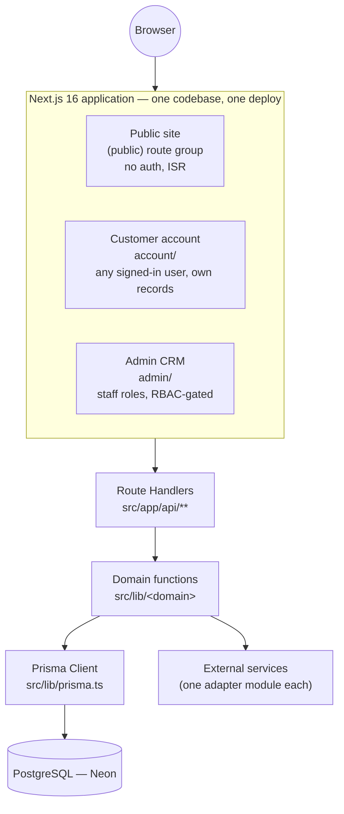
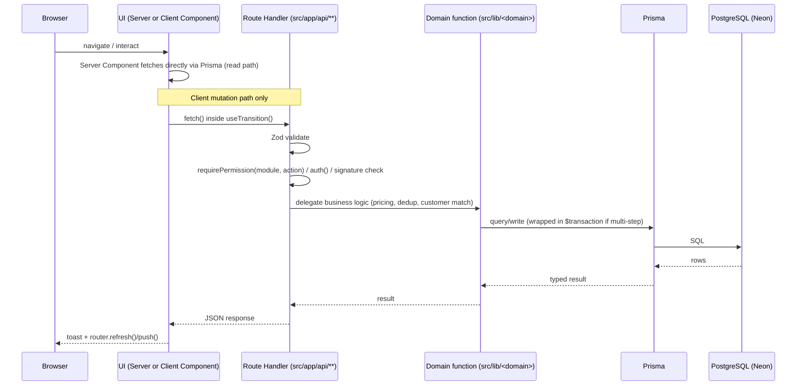

# 03 — Architecture

> **What this section explains:** the system-wide shape of VK — how the browser, the application, and the database relate; the major architectural decisions and why they were made; and where the codebase currently deviates from its own stated target architecture.
>
> **Confidence:** Confirmed from `.ai/context/architecture-overview.md`, `.ai/instructions/architecture.md`, and the six accepted ADRs in `.ai/adr/`. Cross-checked against `src/proxy.ts`, `src/lib/rbac.ts`, `src/lib/permissions.ts`, and the API-route research in §09.

---

## System shape

VK is **one Next.js 16 (App Router) application**, not a set of microservices. Three logical surfaces are route groups inside that single codebase, sharing one database and one deployment:

This is a deliberate, documented choice — see ADR-backed decisions below — not an accident of a small team building fast. The three surfaces are distinguished entirely by route group and auth requirement, never by separate deployments:

| Surface | Path prefix | Auth | Data access boundary |
|---|---|---|---|
| Public site | `src/app/(public)/` | None | `published: true` only, no draft-preview mechanism |
| Customer account | `src/app/account/` | Any authenticated user | Own records only (`where: { userId: session.user.id }`) |
| Admin CRM | `src/app/admin/` | Staff roles (`SUPERADMIN`/`ADMIN`/`DEVELOPER`/`SALES`/`EDITOR`) | All records, `requirePermission(module, action)` per route |

## Request flow (the one direction data moves)

UI never reaches around this flow to call Prisma or an external API directly — only Route Handlers and Server Components import `@/lib/prisma`. See §06/§07 for the frontend/backend detail behind each box.

## The six ADR-backed decisions

Full records live in `.ai/adr/`; the curated summary (`.ai/context/architecture-overview.md`) is reproduced here because it is the single most load-bearing document for understanding *why* VK is built the way it is. See §34 for the ADR process itself.

| # | Decision | Why it matters |
|---|---|---|
| [0001](../../.ai/adr/0001-route-handlers-over-server-actions.md) | Route Handlers + `fetch` + `useTransition`, **not** Server Actions | One mutation style app-wide; an explicit HTTP boundary where Zod + `requirePermission` always run. `"use server"` appears **nowhere** in this codebase. |
| [0002](../../.ai/adr/0002-prisma-neon-postgres.md) | Prisma + PostgreSQL (Neon), separate dev/prod databases | One typed data-access path; forward-only migrations; experiments never touch production data. |
| [0003](../../.ai/adr/0003-nextauth-three-layer-authorization.md) | NextAuth v5 + three-layer authorization | Defense in depth — no single layer is trusted alone. See §10. |
| [0004](../../.ai/adr/0004-server-computed-pricing.md) | Prices computed server-side; the client never sends an amount | The browser is never trusted with money. See §26. |
| [0005](../../.ai/adr/0005-integration-adapter-pattern.md) | Pluggable adapter pattern for external integrations | Add/swap a provider by touching one file; every integration no-ops gracefully when unconfigured. See §11. |
| [0006](../../.ai/adr/0006-domain-logic-in-lib.md) | Business logic in `src/lib/<domain>`; finance has one source of truth | A number computed in two places eventually disagrees with itself. |

### Why Route Handlers over Server Actions (0001)

The alternative — Next.js Server Actions — was available (this is a Next.js 16 app) and deliberately not adopted. The reasoning: two competing mutation styles in one app is harder to secure and review than one. A Route Handler creates an explicit HTTP boundary where validation and authorization are structurally forced to run; a Server Action can be called from anywhere with less ceremony, which the team judged as a worse default for a codebase where money and PII flow through mutations. Adopting Server Actions later remains possible but would need to be a deliberate, documented, project-wide decision (a new ADR), not something that creeps in feature-by-feature.

### Why Prisma + Neon with two databases (0002)

A single `PrismaClient` instance (`src/lib/prisma.ts`) is the only way application code reaches PostgreSQL — this gives end-to-end type safety from schema to query result and one seam to manage (connection pooling, query logging, etc.). Neon (serverless Postgres) hosts **two entirely separate databases** — development and production — so local/dev experimentation structurally cannot touch live bookings, payments, or customer data. Migrations are forward-only (Prisma Migrate has no down-migration mechanism); undoing a schema change means writing a new forward migration, never hand-editing history.

### Why three-layer authorization (0003)

No single layer is the sole guard:

1. **Edge middleware** (`src/proxy.ts`) — coarse staff-vs-non-staff routing, run before NextAuth's session machinery kicks in for most routes.
2. **Admin layout** (`src/app/admin/layout.tsx`) — resolves the requested route to an RBAC module and checks `view` permission; this is a UX gate (renders `AccessDenied`), not the real enforcement.
3. **`requirePermission(module, action)` inside the Route Handler** — the actual enforcement. UI visibility is never treated as authorization.

Full mechanics in §10.

### Why server-computed pricing (0004)

Every payment amount is computed on the server from stored data (`Booking.amount`, `tour.priceFrom`) — the client sends *what* to pay for, never *how much*. A tampered client request can change what a user tries to buy, never the price charged. The Razorpay flow is server-verified end to end (`create-order` → checkout → `verify-payment` HMAC check → `webhook` async confirmation). Full detail in §26.

### Why the integration adapter pattern (0005)

Every multi-provider integration (the offline-conversion uploaders in particular — `lib/offlineConversion/adapters/{google,meta,microsoft}.ts`) follows one shape: a common interface, an `isConfigured()` guard, and a `send()`/upload method per provider. Callers speak to the interface, never a vendor SDK directly, so adding or swapping a provider touches one file. Every adapter no-ops gracefully when unconfigured — local development needs zero third-party setup, and a missing env var never crashes a request in any environment. Full inventory in §11.

### Why domain logic lives in `lib/<domain>` (0006)

Business logic — especially anything financial — lives in `src/lib/<domain>/`, never inside a component, never duplicated. `computeBookingFinance`, `computeDiscountAmount`, `resolveGst` are the single source of truth for every money calculation in the system; the API that writes a value and the UI that displays it always agree because both import the same function. Full detail in §26 and `.ai/skills/booking-finance.md`.

## Layered architecture

| Layer | Location | Responsibility |
|---|---|---|
| **Presentation** | `src/app/**` (routes/layouts/metadata), `src/components/**` (domain-organized: `bookings/`, `leads/`, `admin/`, `tours/`, `ui/` for shared primitives) | Server Components by default; Client Components only per the rules in §06 |
| **Application** | Client-side orchestration: `useTransition`-wrapped `fetch()`, local state, `src/components/providers/` Context (`ThemeProvider`, `SiteSettingsProvider`, `SiteAnalytics`, `AttributionCapture`) | No dedicated `src/hooks/` directory exists yet — a named, not-yet-built target (see §35) |
| **Domain** | `src/lib/<domain>/` (`bookings/finance.ts`, `payments/gst.ts`, `leads/schema.ts`, `bookings/customer.ts`, `bookings/commission.ts`, `salary/*`, `leave/*`, …) | Pricing, GST, lead dedup, customer resolution, commission/payroll math — never inline in a component or route |
| **Infrastructure** | Prisma/Neon, Cloudinary, Razorpay, Upstash Redis, Cloudflare Turnstile, Google (OAuth/Ads/Places), Meta CAPI, Jitsi/JaaS | Each behind one dedicated module — never instantiated ad hoc |

The "domain function" step in the request-flow diagram above is real but **not yet universal**: several Route Handlers still call `prisma.<model>.create/update` directly inline for simple CRUD rather than through a named domain function. The target (`.ai/instructions/architecture.md` §5) is that any operation with real business logic always goes through a named `lib/<domain>` function; simple CRUD may legitimately stay inline in the Route Handler. This is a stated, tracked gap, not an inconsistency to silently paper over.

## Server vs. Client Components

Server Components by default; a component becomes a Client Component (`"use client"`) only for a genuine reason:

- Browser APIs (`localStorage`, `matchMedia`, clipboard)
- Forms (React Hook Form + Zod resolvers require client state)
- Interactive state (admin tables/filters, wizards, anything with `useState`/`useTransition`)
- Animations (Framer Motion)
- Third-party browser SDKs (Turnstile widget, Google One Tap, Razorpay `checkout.js`, the Three.js `r3f` hero mode)

## State management

- **Server Components first** — most page state is "what did Prisma return," fetched once per request.
- **React state + `useTransition`** for local UI state and the mutation lifecycle.
- **Context only for genuinely cross-cutting client state** — exactly three providers today: `ThemeProvider` (admin dark mode), `SiteSettingsProvider` (site name/WhatsApp/phone), and the GTM/analytics providers (`SiteAnalytics`). A fourth provider is held to the same bar.

## Error handling philosophy

- A failed *non-critical* step (e.g. a notification email after a successful booking) is caught and logged — never allowed to fail the primary operation.
- API error responses are short and human-readable — never a raw Prisma or gateway error string.
- Structured logging is a **target, not current state** — today, operational events use plain `console.log`/`console.error` (see §22, §35).
- Retry exists in exactly one place today: offline-conversion uploads (`OfflineConversion.attempts`) — not a general pattern to assume elsewhere.

Full detail in §23.

## Performance posture

- **Lazy loading**: `next/dynamic({ ssr: false })` for the admin revenue chart (Recharts) and client-side itinerary PDF export (`@react-pdf/renderer`). The Three.js hero mode (`HeroR3F`) is currently **orphaned** — not imported by any route, ships nowhere; must go behind the same boundary if reintroduced.
- **Image optimization**: `next/image` + `sharp` project-wide on the public site; a handful of campaign marketing components still use a raw `` (tracked gap, see §35).
- **Bundle splitting**: `@next/bundle-analyzer` wired into `next.config.ts` (`ANALYZE=true yarn build`).
- **Caching**: ISR (`revalidate = 300`) on published public content; `force-dynamic` on admin/account/booking pages. Full table in §17.
- **Server rendering**: RSC by default (see above).

No premature optimization — memoization is applied only after profiling shows a real re-render cost, never speculatively.

## Where the codebase deviates from its own target

`.ai/instructions/architecture.md` and `.ai/instructions/coding-standards.md` both state explicitly that they describe an **aspirational target**, not necessarily current reality (see file headers). The confirmed, named gaps as of this documentation pass:

- Domain-function delegation is real but incomplete (see Layered Architecture above).
- `src/hooks/` doesn't exist yet as a top-level directory — a hydration-mount-guard pattern is duplicated across several components instead of extracted once.
- The payment-verification path (`verify-payment`/`webhook`/`reconcile`) was the one confirmed Prisma-transaction gap as of the last `.ai/` update — cross-check current state in §08/§35, since `.ai/instructions/architecture.md` §8 also notes this was since closed for the online-payment path via `recordOnlinePayment` (VERTE-16) and for Connect chat writes (VERTE-35).

This is treated as normal, tracked technical debt (§35), not a documentation failure — the architecture doc says up front that it describes the destination, not necessarily the current position.

## Related Documents

- `.ai/context/architecture-overview.md`, `.ai/instructions/architecture.md`, `.ai/adr/README.md`
- §06 Frontend Architecture, §07 Backend Architecture, §08 Database Architecture
- §10 Authentication & Authorization (full three-layer mechanics)
- §11 Third-Party Integrations (full adapter-pattern inventory)
- §26 Core Business Flows (server-computed pricing end to end)
- §34 Architecture Decision Records, §35 Technical Debt
