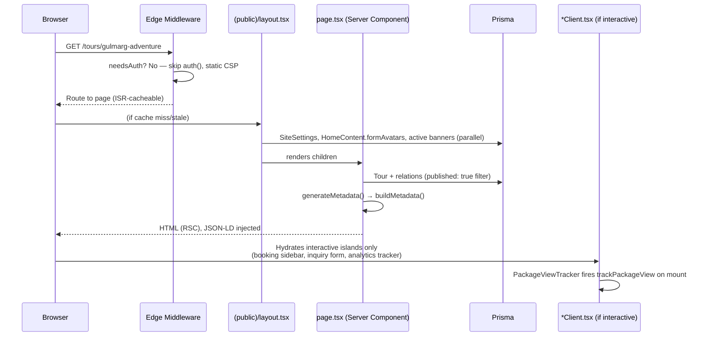

# 06 — Frontend Architecture

> **What this section explains:** routing, rendering strategy, component organization, forms, and the design system — how a user request actually travels through the frontend to become pixels on screen.
>
> **Confidence:** Confirmed from `.ai/instructions/architecture.md`/`coding-standards.md`, `docs/DESIGN_SYSTEM.md` (read in full), and direct research of the public site structure, error/loading file coverage, and JSON-LD usage.

---

## Routing — App Router, four route groups

```
src/app/
├── (public)/    — no URL segment, no auth
├── admin/        — staff CRM
├── account/       — customer portal
└── login/         — sign-in
```

Public page inventory (`(public)/`): homepage; `/tours`, `/tours/[slug]`, `/tours/category`, `/tours/category/[category]`, `/tours/kashmir-tour-packages-from/[city]` (SEO origin-city landing pages); `/destinations`, `/destinations/[slug]`; `/adventures`, `/adventures/[slug]` (campaign microsites, backed by the `Campaign` model); `/activities`, `/activities/[slug]`; `/blog`, `/blog/[slug]`, `/blog/author/[slug]`; `/careers`, `/careers/[slug]`; `/booking`, `/booking/(checkout)`, `/booking/success`, `/booking/failed`; `/contact`, `/about`, `/faq`, `/reviews`, `/b2b-travel-partner-program`; `/[slug]` catch-all for legal pages.

## Request-to-pixels flow



Page and layout files are **thin orchestrators** — fetch data, pass props; all interactivity/state/mutations live in the matching `*Client.tsx` (`.ai/instructions/coding-standards.md` → Next.js Standards).

## `(public)/layout.tsx` — what it fetches once for the whole subtree

In parallel: `SiteSettings` singleton, active announcement strip, active promo banners, a Prisma `groupBy` for populated tour categories, `HomeContent.formAvatars` (reused sitewide as social-proof avatars on lead forms), active corporate offices. It wires: `ThemeProvider` (dark default — admin only, see below), `TooltipProvider`, `SiteAnalytics`, `CookieConsentManager`, `SiteSettingsProvider`, `PublicChrome` (nav/footer/banners), `AnnouncementModal`, and a `sonner` `Toaster`. It also injects the sitewide `TravelAgency` JSON-LD once here.

## Server vs. Client Components

Server Components by default; a component becomes `"use client"` only for: browser APIs, forms (React Hook Form + Zod), interactive state (`useState`/`useTransition`), animations (Framer Motion), or third-party browser SDKs (Turnstile, Google One Tap, Razorpay `checkout.js`, Three.js). Full rule set in §03.

## The client mutation pattern

```tsx
"use client";
const router = useRouter();
const [isPending, startTransition] = useTransition();

// In-place mutation (delete, status change) — refresh, no navigation
startTransition(async () => {
  const res = await fetch(`/api/resource/${id}`, { method: "DELETE" });
  if (!res.ok) { toast.error("Failed."); return; }
  toast.success("Deleted.");
  router.refresh();
});

// Create/edit — navigate back to the list
startTransition(async () => {
  const res = await fetch("/api/resource", { method: "POST", /* ... */ });
  if (!res.ok) { toast.error("Save failed."); return; }
  toast.success("Saved.");
  router.push("/admin/resource");
  router.refresh();
});
```

This exact `fetch()` → `useTransition()` → `toast` → `router.refresh()`/`push()` shape is used everywhere a mutation happens in the app — Server Actions are never used (ADR 0001).

## Loading states — route-level Suspense boundaries

**32 `loading.tsx` files** exist across the app: public detail-heavy routes (`tours`, `tours/[slug]`, `destinations`, `destinations/[slug]`, `blog`, `blog/[slug]`, `contact`, `booking/success`, `booking/failed`, `booking/(checkout)`), the large majority of admin routes (~20 — dashboard, bookings, leads, packages, blogs, itinerary, reviews, banners, careers, users), and three account routes (`payments`, `bookings`, `bookings/[id]`). Each is composed from shared skeleton molecules (`ListSkeleton`, `FormSkeleton`, `HeroSkeleton`, `CardGridSkeleton`, built on a `Skeleton` atom) mirroring the real page's layout so the swap causes no layout shift, with `aria-busy="true"` + an `aria-label` on the route's outermost element only.

**The nesting gotcha** (`.ai/instructions/coding-standards.md`): a segment's `loading.tsx` also wraps its children — on a hard load, the outer fallback renders. This is why the booking checkout page lives at `booking/(checkout)/page.tsx` (a URL-transparent route group) rather than directly under `booking/` — otherwise `booking/loading.tsx`'s form skeleton would incorrectly cover `/booking/success` and `/booking/failed`, which are only ever reached by a Razorpay redirect, not in-app navigation. A known, accepted gap: on a hard load of a public detail page, the parent **listing's** skeleton renders rather than the detail page's own — both open with the same `HeroSkeleton` band, so this was accepted rather than restructuring those segments into route groups.

## Error handling coverage — narrower than loading states

Only **2** special error files exist, both at the root `src/app` level, shared across every route group: `error.tsx` and `not-found.tsx`. **No per-route overrides** and **no `global-error.tsx`** exist anywhere in the repository. Full implication in §23.

## Design System (`docs/DESIGN_SYSTEM.md`)

| Token category | Source of truth | Highlight |
|---|---|---|
| Color | `globals.css` (`:root`/`.dark`) + `tailwind.config.ts` | Semantic HSL tokens support opacity modifiers (`bg-primary/20`); a separate fixed brand palette (`green.*`, `navy.*`, `brand.*`, `badge.*`) exists for sections intentionally locked to one visual theme (e.g. Tours' golden theme) regardless of site dark mode |
| Typography | `tailwind.config.ts` fontSize | A normalized even-step scale (10/12/14/16/18/20/22/24px), replacing ~35 previously-arbitrary sizes. One deliberate overlap: `text-sm` and `text-base` both render 16px — semantically distinct in code, visually identical today |
| Spacing | Tailwind defaults, unmodified | No custom spacing scale — arbitrary `p-[Npx]` reserved for genuine one-offs (safe-area insets), not general layout |
| Radius | `tailwind.config.ts` | `rounded-xl` → `rounded-4xl` → `rounded-full`, 1181 codebase occurrences of the established scale |
| Shadow | `tailwind.config.ts` | Named tokens (`shadow-glass`, `shadow-glow`, `shadow-card`, `shadow-soft`, `shadow-gold`); `shadow-card-tours` is defined but **confirmed unused** anywhere — a candidate for removal or first real use |
| Motion | `src/lib/motion.ts` | One canonical easing curve (`EASE_BRAND`, `[0.22, 1, 0.36, 1]`), exposed three ways (JS/Tailwind/CSS custom property) after being hand-copied in 23+ components previously; 6 shared scroll-reveal variants (`fadeUp`, `fadeUpSm`, `fadeUpLg`, `fadeIn`, `fadeLeft`, `fadeRight`) replacing 100+ inline duplicates |
| Breakpoints | Tailwind defaults | `lg` (1024px) is the codebase's real mobile/desktop split (`lg:hidden`/`lg:block`), not `md` |

A **known, documented gap**: three fixed bottom-bar components (`BookingMobileBar.tsx`, `MobileBottomTabs.tsx`, `AccountShell.tsx`) each hand-copy a *different* arbitrary shadow rather than a shared token — left deliberately unresolved since whether they should match is a design decision, not something to silently force.

## Structured data (JSON-LD) coverage

Central builder (`src/components/seo/JsonLd.tsx`, sanitized via `safeLdJson`), graph-based around a shared `@id: ${siteUrl}/#organization` node: `TravelAgency` (sitewide), `WebSite` (homepage only, deliberately — previously sitewide, corrected per Google's guidance), `TouristTrip`/`Product` (tours), `TouristDestination` (destinations), `TouristAttraction` (activities), `BlogPosting` (blog), `Product`+`Event` (campaign tiers/batches), `FAQPage`, Organization augmentations for reviews/contact/about, `CollectionPage`+`ItemList` (listing/category hubs), `BreadcrumbList`, `ImageObject`. **Not covered**: careers/job pages, the booking/checkout flow, the b2b-travel-partner-program page. Full SEO detail in §30.

## Search on the public site

None — see §16.

## Related Documents

- `docs/DESIGN_SYSTEM.md` — the full, authoritative token reference this section summarizes
- `.ai/instructions/architecture.md` §3–4, `.ai/instructions/coding-standards.md` → Next.js Standards
- §03 Architecture — Server/Client Component rules, state management philosophy
- §07 Backend Architecture — the Route Handlers these client mutations call
- §23 Error Handling — the narrow `error.tsx`/`not-found.tsx` coverage, implications
- §30 SEO & Web Performance — metadata, sitemap, structured data in full
