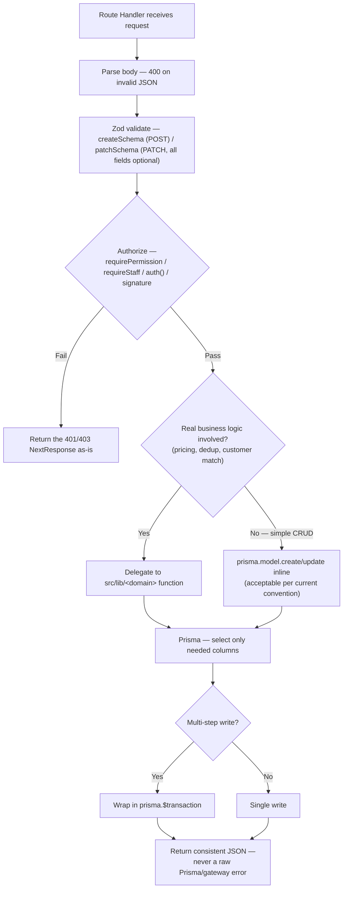

# 07 — Backend Architecture

> **What this section explains:** the request lifecycle on the server side — routing, the domain-function layer, error handling, logging, and how external services are called — and how honestly the codebase separates these concerns today versus its stated target.
>
> **Confidence:** Confirmed from `.ai/instructions/architecture.md` §2/§6/§8/§11, `.ai/skills/api-route.md`, and the route research underlying §09.

---

## No formal layered framework — but a consistent, real pattern

VK doesn't use a framework-enforced layered architecture (no NestJS-style modules/controllers/services/repositories). The layering is a **convention**, followed consistently enough to document as real: Route Handler (orchestration) → domain function in `src/lib/<domain>` (business logic, where one exists) → Prisma (data access). `.ai/instructions/architecture.md` is explicit that this is honest documentation of the *actual* architecture, not an idealized one — where the codebase deviates (simple CRUD staying inline in the Route Handler rather than a named domain function), that's stated as a real, current gap, not glossed over.

## Request lifecycle

## Where domain logic actually lives

`src/lib/<domain>/` — never inside a component, never duplicated:

| Domain | Files | What it owns |
|---|---|---|
| Bookings | `finance.ts`, `commission.ts`, `commissionSync.ts`, `scope.ts`, `customer.ts`, `itineraryToServices.ts`, `cleanup.ts`, `invoice-pdf.tsx` | Pricing/discount/balance math, commission calculation, RBAC scoping (`bookingWhereForUser`), lead-to-customer resolution, itinerary→services seeding, stale-booking cleanup |
| Payments | `gst.ts` | GST calculation, cash-vs-non-cash detection |
| Leads | `schema.ts` | Zod validation shared between the lead form and the API route |
| Salary | `month.ts`, `compute.ts`, `prepare.ts`, `salary-slip-pdf.tsx` | Payroll month math, net-salary computation, batch preparation |
| Leave | `entitlement.ts` | Leave-balance computation (no stored balance — derived on read) |
| Security | `turnstile.ts`, `mfaTotp.ts`, `mfaCrypto.ts` | Bot-check verification, TOTP generation/verification, MFA-secret encryption |
| Offline Conversion | `service.ts`, `adapters/{google,meta,microsoft}.ts` | Ad-platform conversion enqueue/upload, the adapter-pattern reference implementation |

This is the concrete instance of ADR 0006 (business logic in `lib/<domain>`, finance single-sourced) — `computeBookingFinance`, `computeDiscountAmount`, `resolveGst` are the only place any money is computed anywhere in the codebase (§26 walks the exact sequence).

## The one confirmed transaction gap (historically) — and its current status

`.ai/instructions/architecture.md` §8 names the payment-verification path (`verify-payment`/`webhook`/`reconcile`) as the one confirmed spot where a multi-step write wasn't wrapped in `prisma.$transaction`, while noting it has since been closed via `recordOnlinePayment` (VERTE-16), which commits the payment ledger row and booking-status update atomically. Connect chat writes similarly gained transaction coverage (VERTE-35) — the message row, sender's read marker, and recipients' notifications commit together. Treat this as **resolved per the latest `.ai/` update**, but see §35 for how to re-verify if this becomes load-bearing for a future change.

Established, confirmed `$transaction` usage elsewhere: lead conversion (customer resolution + booking creation + lead update + itinerary lock, one transaction), lead unlock, admin bulk lead actions, itinerary updates, MFA confirm.

## Error handling philosophy (backend)

- A failed **non-critical** step (a notification email after a successful booking) is caught and logged — never allowed to fail the primary operation. `sendMail()` throwing when SMTP is unconfigured is explicitly expected and handled this way.
- API error responses are short and human-readable — never a raw Prisma or gateway error string. A caught `"P2002"` (Prisma unique-constraint violation) becomes a `409` with a human message.
- **Retry** exists in exactly one place: `OfflineConversion.attempts`/`lastError` — not a general pattern assumed to exist for, say, a failed Cloudinary or Razorpay call.

Full detail in §23.

## Logging — current state, honestly

**Structured logging is a stated target, not current reality.** Operational events (upload progress, mail send results, offline-conversion upload attempts) use plain `console.log`/`console.error` today — accepted as normal until a centralized logger exists (tracked in the engineering backlog). This documentation reports this as current state, not as a defect being newly discovered. Full detail in §22.

## How external services are called

Every integration goes through one dedicated module (`lib/prisma.ts`, `lib/storage.ts`, `lib/ratelimit.ts`, `lib/security/turnstile.ts`, `lib/offlineConversion/adapters/*`) — never instantiated ad hoc inside a Route Handler. This is ADR 0005 applied backend-wide, not just to the offline-conversion adapters that are its reference implementation. Full inventory in §11.

## Validation

Zod schemas: a `createSchema` per POST, a `patchSchema` per PATCH (identical shape, every field made `.optional()`/`.optional().nullable()`, so a partial save never has to resend the whole record). Shared between the client form and the Route Handler wherever a schema already exists for the domain (`src/lib/leads/schema.ts`, `src/lib/admin/campaignSchema.ts`) — never duplicated as two parallel definitions. `Tour`/`Campaign` JSON-string columns are validated as `z.string()`, not `z.array(...)` (§08, §12).

## Related Documents

- `.ai/instructions/architecture.md` §2, §6, §8, §11 — the source for this section's honesty about current-vs-target state
- `.ai/skills/api-route.md`, `.ai/skills/booking-finance.md` — the concrete build patterns
- §08 Database Architecture — the `$transaction` convention in full schema context
- §09 API Architecture — every route this layering applies to
- §22 Observability, §23 Error Handling — the logging/error picture in full
- §26 Core Business Flows — the domain functions above, walked through a real transaction
