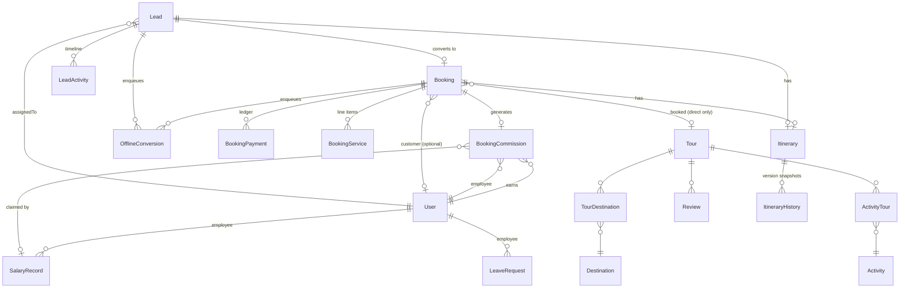

# 08 — Database Architecture

> **What this section explains:** the complete database schema — every model, enum, and relationship — how migrations work, and the conventions (JSON-string columns, singleton rows, soft delete) that govern how the schema is used.
>
> **Confidence:** Confirmed from `prisma/schema.prisma` (2,068 lines, read in full), `prisma/migrations/`, `.ai/instructions/coding-standards.md` → Database Standards, and `.ai/skills/prisma-migration.md`.

---

## Quick Reference

| | |
|---|---|
| Database | PostgreSQL, hosted on **Neon** (serverless Postgres) |
| Environments | **Two entirely separate databases** — dev and prod, never auto-synced |
| ORM | Prisma 6.19.3 — single client instance (`src/lib/prisma.ts`) |
| Models | **69** |
| Enums | **32** |
| Migrations | **23** committed folders, forward-only (no down-migrations) |
| Raw SQL | Zero usage — no `$queryRaw`/`$executeRaw` anywhere in the codebase |

## Architectural rules (non-negotiable, per `.ai/instructions/coding-standards.md`)

- Never call `new PrismaClient()` outside `src/lib/prisma.ts`.
- Never query the database from a UI component (`src/components/**`) — only Route Handlers and Server Components import `@/lib/prisma`.
- Multi-step writes use `prisma.$transaction` — established for lead conversion, lead unlock, admin bulk lead actions, itinerary updates, MFA confirm, the online-payment path (`recordOnlinePayment`, VERTE-16), and Connect chat message writes (VERTE-35).
- Every schema change ships a real migration (`yarn db:migrate`) — never left as `db:push`-only.
- Public list endpoints use **cursor-based** pagination; admin list endpoints use **offset** (`skip`/`take`) — the two are never mixed on one endpoint.
- A caught Prisma error checked for `"P2002"` (unique-constraint violation) returns `409` with a human message, never a raw DB error.

## Entity-relationship diagram — core domain

The 69-model schema is large; this diagram covers the core booking/lead/tour domain that drives the primary business flow (§26). See the full model table below for everything else.

## Full model inventory

### Core transactional models

| Model | Purpose | Key fields | Key relations |
|---|---|---|---|
| **User** | Every human account — staff and customer share one table, distinguished by `role` | `email` (unique), `passwordHash`, `role`, `mustChangePassword`, `mfaSecret` (encrypted), `deletedAt` (soft delete), employee fields (`employeeCode` unique, `monthlySalary`, `bookingConversionPct`, `joiningDate`), B2B agent fields (`agencyStatus`, `agencyName`, `agencyGstin`, …) | `bookings`, `commissions`, `salaryRecords`, `leaveRequests`, `itineraries`, `leadsAssigned`, Vertex Connect relations (chat/presence/meetings) |
| **Lead** | Every enquiry — website, manual, B2B request | `status: LeadStatus`, `source: LeadSource`, `category?: LeadCategory`, `assignedToId?`, `b2bAgentId?` (discriminates a B2B request), `bookingId?`, `locked`, full UTM/click-id attribution block | `assignedTo`/`b2bAgent`/`createdBy User?`, `booking Booking?`, `activities LeadActivity[]`, `itinerary Itinerary?` |
| **Booking** | The financial/operational core | `status: BookingStatus`, `amount`, `razorpayOrderId?` (unique), `discountType`/`discountValue`, `servicesLocked`, `deletedAt` (soft delete), same UTM/attribution block as Lead | `tour Tour?`, `user User?`, `leads Lead[]`, `payments`, `services`, `itinerary?`, `commission?` |
| **BookingPayment** | The payment ledger — one row per collection/refund | `amount`, `type: PaymentType` (TOKEN/PARTIAL/FINAL/REFUND), `method?`, `gstPercent?`, `gstAmount?` | `booking Booking` (Cascade) |
| **BookingService** | Line items — hotel/transport/activity/other | `kind: ServiceKind`, `amount`, `sortOrder` | `booking Booking` (Cascade) |
| **Itinerary** | The trip plan — links exclusively to a Lead or a Booking, never both | `status: ItineraryStatus`, `data Json` (real JSON, not string), `leadId?` unique, `bookingId?` unique, `locked`, Razorpay Payment-Link token fields | `owner User` (Cascade), `lead?`/`booking?` (Cascade), `history ItineraryHistory[]` |
| **ItineraryHistory** | Append-only version snapshots | `data Json`, `editedById?`, `editedByName` | `itinerary` (Cascade) |
| **Tour** | Public tour package | `slug` (unique), `category: TourCategory`, `region: TourRegion`, `priceFrom`, `published`, `formMode: TourFormMode`, + **15 JSON-string columns** | `bookings`, `reviews`, `destinations` (m2m), `activities` (m2m), `relatedFaqs` (m2m) |
| **BookingCommission** | Salesperson commission ledger — one row per lead-converted booking | `rateSnapshotPct` (frozen at creation), `profitAmount`, `commissionAmount`, `status: CommissionStatus` (EXPECTED/EARNED/PAID/REVERSED), `salaryRecordId?` | `booking` (Cascade), `employee User`, `salaryRecord?` |
| **SalaryRecord** | Monthly payroll snapshot | `salaryMonth` ("YYYY-MM"), `status: SalaryStatus` (DRAFT/REVIEW/PAID), `netSalary`, `commission`, `correctedAt?`/`correctionReason?` | `employee`, `paidBy`, `correctedBy User`; `claimedCommissions BookingCommission[]`; unique `[employeeId, salaryMonth]` |
| **LeaveRequest** | Employee leave tracking, no stored balance | `type: LeaveType`, `days Float` (0.5 granularity), `status: LeaveStatus` | `employee`, `reviewedBy User` |

### Catalog / content models

| Model | Purpose |
|---|---|
| Destination, Activity | Public catalog entities, each with several JSON-string columns; joined to Tour/each other via `TourDestination`/`ActivityTour`/`ActivityDestination` |
| Blog, BlogCategory, BlogContent | Blog system — post, taxonomy, index-page singleton |
| Campaign | Landing-page "Adventures" microsite — 11 JSON-string columns |
| Faq, FaqCategory | **Centralized** FAQ system — a real relation table (`FaqPlacement[]` enum array controls where it surfaces), replacing an older per-model JSON `faqs` pattern |
| Review | Tour review, `approved` gate before public display |
| Job | Careers listing — 4 JSON-string columns |
| Gallery | Media library asset |
| Banner | Promo/strip banner, `pages String` (JSON page-targeting list) |
| HotelSupplier | Internal B2B hotel-rate reference for Sales — **not** bookable customer-facing inventory |

### Singleton CMS content models

One row each, `id: "singleton"`, read via `findUnique`, written via `upsert` (never `create` a second row): `SiteSettings`, `HomeContent`, `AboutContent`, `ContactContent`, `BlogContent`, `ReviewsContent`. Each has satellite list models for repeated sections (`HeroSlide`, `SiteStat`, `TickerItem`, `VideoReview`, `WhyChooseItem`, `Offer`, `AboutStoryFeature`, `AboutStat`, `AboutValue`, `Certification`, `TeamMember`, `JourneyMilestone`, `PressLogo`, `ContactHeroFeature`, `ContactPromiseItem`, `ContactOffice`, `HomeSection`).

### Vertex Connect (internal chat/video)

`ChatRoom` (DIRECT/GROUP, unique `directKey` per DM pair), `ChatMember`, `ChatMessage` (Cloudinary attachments, reactions, soft-delete/edit, system messages), `UserPresence` (ONLINE/AWAY/BUSY/OFFLINE), `Meeting` (Jitsi, `jitsiRoomId` unique), `MeetingParticipant`. Full flow in §28.

### Security / audit / operational models

| Model | Purpose |
|---|---|
| MfaRecoveryCode | Bcrypt-hashed one-time TOTP recovery codes |
| AuditLog | Role changes, permission edits, user soft/hard-delete/restore, salary lifecycle, leave lifecycle, B2B agent status change (`AuditAction` enum, 14 values) |
| LeadActivity | Per-lead immutable timeline (status/assignment changes, notes, follow-ups, attachments) |
| PaymentAudit | Append-only Razorpay gateway event trail (loose `bookingId` reference, no FK) |
| RolePermission | The RBAC matrix — `[role, module]` unique, four booleans (view/create/edit/delete) |
| EmailOtp | OTP verification across 5 purposes (register/reset/careers/booking/B2B) |
| WhatsAppAttributionToken | Bridges marketing attribution across a WhatsApp handoff into a future Lead |
| OfflineConversion | Sync queue to Google/Meta/Microsoft ad platforms — `attempts`/`lastError` retry tracking, the one confirmed retry mechanism in the codebase |
| AdminDocument, AdminDocLink | Internal staff reference material — uploaded files vs. external links, same `docs` RBAC module |
| NewsletterSubscriber | Confirmed **dormant** — schema exists, zero usage anywhere in application code |
| LegalPage | Terms/Privacy/Refund content, `slug` as primary key |

## JSON-encoded `String` columns — a deliberate, repository-wide convention

Some columns store JSON **inside a `String` field**, not Prisma's native `Json` type — this is intentional, not an oversight, per `.ai/instructions/coding-standards.md`. Every consumer must `JSON.stringify` on write and safely `JSON.parse` (with a fallback) on read, centralized — never parsed inline in multiple places.

| Model | Count | Fields |
|---|---|---|
| **Tour** | 15 | `gallery`, `itinerary`, `inclusions`, `exclusions`, `batches`, `highlights`, `perfectFor`, `notIdealFor`, `accommodation`, `budgetBreakdown`, `personalExpenses`, `thingsToCarry`, `localTravelTips`, `importantNotes`, `relatedTours` |
| **Campaign** | 11 | `facts`, `strip`, `stats`, `highlights`, `activities`, `itinerary`, `tiers`, `batches`, `inclusions`, `exclusions`, `gallery` |
| **Destination** | 6 | `whyVisit`, `topAttractions`, `localFood`, `shopping`, `travelTips`, `relatedBlogIds` |
| **Activity** | 5 | `images`, `activityHighlights`, `suitableFor`, `safetyTips`, `whatToCarry` |
| **Job** | 4 | `responsibilities`, `requirements`, `preferredSkills`, `benefits` |
| Various single-field cases | 1 each | `Blog.relatedTours`, `HomeContent.formAvatars`, `Banner.pages`, `Lead.attachments`, `Booking.inclusions`, `SiteSettings.gstRates`, `BookingPayment.metadata`, `OfflineConversion.platformResponse`, `ChatMessage.reactions`, `PaymentAudit.detail` |

**Not a JSON-string column:** `faqs` is a real `Faq[]` relation on both `Tour` and `Campaign` — it was migrated off this pattern. `testimonials` is not a field on `Campaign` at all.

**Real `Json`-typed fields** (the exception, not the rule): `Itinerary.data`, `ItineraryHistory.data`, `ProposalItinerary.data`, `HotelSupplier.data`, `AuditLog.metadata`.

## Full enum list (32)

`Role`, `OtpPurpose`, `HotelCategory`, `OfflineConversionPlatform`, `OfflineConversionStatus`, `EmploymentType`, `FaqStatus`, `FaqPlacement`, `B2BAgentStatus`, `TourCategory`, `TourRegion`, `BookingStatus`, `PaymentType`, `ServiceKind`, `CommissionStatus`, `SalaryStatus`, `LeaveType`, `LeaveStatus`, `LeadStatus`, `LeadSource`, `TourFormMode`, `LeadCategory`, `LeadActivityType`, `AuditAction`, `ItineraryStatus`, `ProposalStatus`, `RoomType`, `MemberRole`, `PresenceStatus`, `MeetingStatus`, `MeetingType`, `BannerType`.

Full value lists for the business-critical enums (`LeadStatus`, `LeadSource`, `BookingStatus`, etc.) are in §02 Product & Business Context, alongside the business rule each one encodes.

Note: `LeadStatus` includes an `IN_PROGRESS` value not mentioned in `.ai/context/business-rules.md`'s lead-status list — it appears to double as the B2B-request "pending" state, per the schema research. **Requires verification** against current admin UI behavior before treating this as fully documented.

## Migrations

23 committed folders under `prisma/migrations/`, forward-only (Prisma Migrate has no down-migration mechanism — reversing a change means writing a new forward migration, never hand-editing or deleting an applied one).

- **Baseline**: `20260717000000_baseline` — the schema history was fully re-baselined into one migration on 2026-07-17 after the prior per-change history (built from ad hoc `db:push` usage) turned out to have significant gaps. Pre-baseline history is archived under `prisma/migrations_archive/` for reference only — **not read by Prisma**.
- **A naming quirk worth noting**: `20260712173655_add_performance_indexes` predates the baseline by timestamp but is a separate folder — it is not literally the earliest migration by file-system order despite "baseline" being the conceptual starting point. Not a functional problem (migrations apply in timestamp order regardless of the word "baseline" in a filename), but worth knowing if you're reading migration history chronologically.
- **Latest**: `20260915050021_add_admin_doc_link` (today, at time of writing).
- Migration cadence per `.ai/instructions/coding-standards.md`: one migration file per sprint once that sprint's schema changes are finalized, not one per individual change.
- Notable feature migrations tracing the product's growth: `add_hotel_supplier`, `add_booking_commission`, `add_salary_leave_module`, `add_b2b_agent_fields`, `add_b2b_requests_fields`, `add_proposal_itinerary_module`, `add_audit_log`, `add_careers_module`, `add_whatsapp_attribution_token`, `add_admin_document`, `add_admin_doc_link`.

## Database safety — two separate Neon databases

Development and production are **never automatically synced**. A migration applied to one does not touch the other.

- **Development** — `yarn db:push` (no migration file) or `yarn db:migrate` (records one) are both fine.
- **Production** — reached only through a committed migration applied via the deploy pipeline, never an ad hoc `db:push`. `prisma migrate reset` (or any destructive operation) must never run against it.

Before any schema change reaches production: (1) does it need to reach production, or is it a local experiment; (2) does a real migration file exist, or only a local `db:push`; (3) is a new column nullable/defaulted so it won't fail against existing production rows; (4) has `npx prisma migrate status` been checked to confirm production isn't already out of sync. See §31 (Disaster Recovery) and §32 (Runbooks) for the applied procedure.

## Other conventions

- **Soft delete** is the default for business records (`User.deletedAt`, `Booking.deletedAt`) — hard delete is a separate, explicit action, reserved for cases like GDPR-style erasure requests.
- **Select-only-what's-needed**: list queries project a subset of columns deliberately, never a full-row fetch to display a few fields.

## Related Documents

- `.ai/skills/prisma-migration.md` — the full schema-change workflow and its Common Mistakes list
- `.ai/instructions/coding-standards.md` → Database Standards
- §02 Product & Business Context — the business meaning behind `LeadStatus`/`BookingStatus`/etc.
- §26 Core Business Flows — how Booking/Payment/Commission rows are created and updated end to end
- §31 Disaster Recovery, §32 Operational Runbooks — production migration procedure
- §35 Technical Debt — the payment-path transaction gap and the `LeadStatus.IN_PROGRESS` documentation gap
