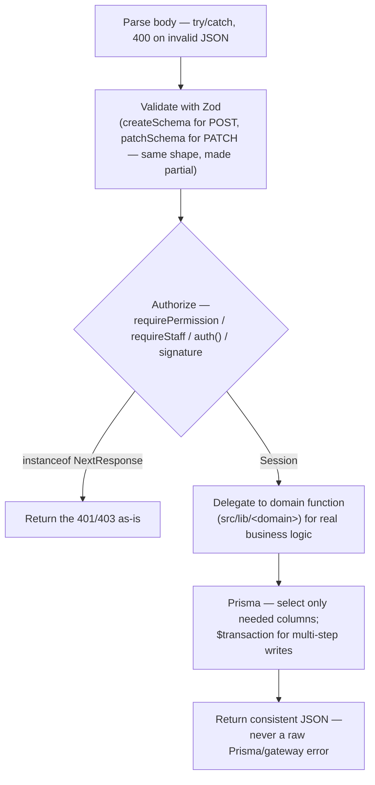

# 09 — API Architecture

> **What this section explains:** the Route Handler pattern used by every API endpoint in VK, the complete route inventory (137 files, ~185 handlers), and the conventions that keep validation, auth, and error handling consistent across public, admin, account, and webhook routes.
>
> **Confidence:** Confirmed from direct inspection of `src/app/api/**` (every route file located and its exports/guard checked), `.ai/skills/api-route.md`, and `.ai/instructions/architecture.md` §8.

---

## Quick Reference

| | |
|---|---|
| Mechanism | Next.js Route Handlers only — Server Actions are **not used anywhere** (ADR 0001) |
| Route files | 137 |
| Exported handlers | ~185 |
| Four auth categories | public · admin/staff · account · webhook |

## The four auth categories

Every route falls into exactly one of these, each with a different guard shape:

| Category | Guard | Data scope | Example |
|---|---|---|---|
| **Public** | None — relies on a `published: true` filter instead | Published records only | `GET /api/tours` |
| **Admin/staff** | `requirePermission(module, action)`, or `requireStaff()` for a non-module route | All records | `GET /api/bookings` |
| **Account** | `auth()` directly, then every query scoped to `where: { userId: session.user.id }` — never `requirePermission` (that's staff-only) | Own records only | `GET /api/account/bookings/[id]/invoice` |
| **Webhook/cron** | Signature (HMAC) or shared secret — no session at all | N/A | `POST /api/bookings/webhook`, `GET /api/cron/*` |

## The standard Route Handler sequence

Engineering rules (`.ai/skills/api-route.md`):

- `params` is a `Promise` in Next.js 16 — always `await` it before destructuring.
- Rate-limit abuse-prone/public endpoints (login, OTP, booking creation, lead submission) via `src/lib/ratelimit.ts`, checked **before** body parsing so a flood is rejected on the cheapest path; return rejections via the shared `tooManyRequests()` helper (attaches `Retry-After`) — this is the one error-shape convention that **is** fully standardized across the codebase.
- A caught Prisma `"P2002"` (unique violation) returns `409` with a human-readable message.
- Validation-failure status code is **not fully standardized** — most routes return `422`, but this is a named, tracked gap ("Standardize API Response & Status Codes" in the engineering backlog), not a settled convention — match whatever sibling routes in the same domain already do.

## Full route inventory, by domain

### Auth (`/api/auth/**`)

| Method | Path | Purpose | Auth |
|---|---|---|---|
| * | `/api/auth/[...nextauth]` | NextAuth.js catch-all | public |
| POST | `/api/auth/register` | Disabled legacy stub | public |
| POST | `/api/auth/register/request-otp` → `/verify-otp` | Two-step OTP registration (Turnstile-gated) | public |
| POST | `/api/auth/forgot-password/request-otp` → `/verify-otp` → `/reset-password` | Three-step password reset | public |
| POST | `/api/auth/b2b-register` (+ `/request-otp`, `/verify-otp`) | B2B agent self-registration | public |

### Admin MFA (`/api/admin/mfa/**`)

| Method | Path | Purpose | Auth |
|---|---|---|---|
| POST | `/enroll` → `/confirm` → `/verify` | TOTP enroll/confirm/login-time verify, SUPERADMIN/ADMIN only | staff |

### Admin ops (roles, cache, docs, B2B)

| Method | Path | Purpose | Auth |
|---|---|---|---|
| GET/PUT | `/api/admin/role-permissions` | View/edit the RBAC matrix | `requirePermission(roles, view/edit)` |
| POST | `/api/admin/cache/flush` | Flush public-site cache | staff |
| GET/POST, PATCH/DELETE | `/api/admin/docs`, `/api/admin/docs/links[/[id]]` | Internal doc/link CRUD | `requirePermission(docs, *)` |
| GET/POST, PATCH | `/api/admin/b2b-agents[/[id]]` | B2B agent account management | `requirePermission(b2bAgents, *)` |
| GET/POST | `/api/admin/b2b-requests` | B2B quote requests | `requirePermission(b2bRequests, *)` |
| POST | `/api/admin/b2b-requests/[id]/convert` | B2B request → booking | `requirePermission(b2bRequests, edit)` |
| GET/PATCH | `/api/admin/b2b-itineraries/[id]` | B2B itinerary | `requirePermission(itinerary, *)` |
| GET | `/api/admin/leads/attribution/[token]` | Marketing-attribution lookup for a lead | `requirePermission(leads, create)` |

### Leads

| Method | Path | Purpose | Auth |
|---|---|---|---|
| GET | `/api/leads` | List/search | `requirePermission(leads, view)` |
| POST | `/api/leads` | Public lead-capture submission | public — same-origin check + IP/phone/email rate limits |
| GET/PATCH/DELETE | `/api/leads/[id]` | View/edit/soft-delete | `requirePermission(leads, view/edit/delete)` |
| POST | `/api/leads/[id]/convert` | Lead → Booking | `requirePermission(leads, edit)` |
| POST | `/api/leads/[id]/lock` `/unlock` | Editing-concurrency lock | `requirePermission(leads, edit)` |
| POST | `/api/leads/[id]/itinerary` | Attach itinerary | `requirePermission(itinerary, create)` |

### Bookings

| Method | Path | Purpose | Auth |
|---|---|---|---|
| GET | `/api/bookings` | List/search | `requirePermission(bookings, view)` |
| GET/PATCH/DELETE | `/api/bookings/[id]` | View/edit/cancel | `requirePermission(bookings, view/edit/delete)` |
| POST | `/api/bookings/create-order` | Create Razorpay order | account (guest checkout allowed) |
| POST | `/api/bookings/request-otp` `/verify-otp` | Guest phone verification | public |
| POST | `/api/bookings/verify-payment` | Client-callback payment verification | account (optional) + HMAC signature |
| POST | `/api/bookings/webhook` | **Razorpay server-to-server webhook** | webhook — HMAC-SHA256, timing-safe compare |
| POST | `/api/bookings/[id]/driver` | Assign driver/vehicle | `requirePermission(bookings, edit)` |
| POST | `/api/bookings/[id]/lock-services` | Finalize services | `requirePermission(bookings, edit)` |
| POST/PATCH/DELETE | `/api/bookings/[id]/payments[/[paymentId]]` | Record/edit/void a payment | `requirePermission(bookings, edit)` |
| POST | `/api/bookings/[id]/reconcile` | Reconcile payment state | `requirePermission(bookings, edit)` |
| POST | `/api/bookings/[id]/resend-credentials` `/resend-emails` | Resend guest login / confirmation emails | `requirePermission(bookings, edit)` |
| POST/PATCH/DELETE | `/api/bookings/[id]/services[/[serviceId]]` | Line-item CRUD | `requirePermission(bookings, edit)` |

### Public catalog (Tours / Destinations / Activities)

| Method | Path | Purpose | Auth |
|---|---|---|---|
| GET | `/api/tours`, `/api/destinations` | Public listing (search/filter/sort) | public |
| POST/PATCH/DELETE | same paths + `/[id]` | Admin CRUD | `requirePermission(packages\|destinations, *)` |
| GET/POST, PATCH/DELETE | `/api/activities[/[id]]` | Full CRUD, **no separate public list route** — see anomaly note below | `requirePermission(activities, *)` |

**Anomaly, confirmed by direct inspection:** `GET /api/tours/[id]` and `GET /api/destinations/[id]` require admin `view` permission even though the collection `GET` is public — the public tour/destination *detail* pages evidently source a single record by a different path (a direct Server Component Prisma query, not these `[id]` routes), since these routes return the full admin-shaped record. Worth confirming against `src/app/(public)/tours/[slug]/page.tsx` if this becomes load-bearing for a future change.

### Content CMS (Blogs / FAQs / Galleries / Banners / Campaigns / Reviews)

| Method | Path | Purpose | Auth |
|---|---|---|---|
| GET | `/api/blogs`, `/api/faqs`, `/api/galleries` | Public listing | public |
| POST/PATCH/DELETE | same + `/[id]` | Admin CRUD | `requirePermission(blogs\|faqs\|galleries, *)` |
| GET/POST/PATCH/DELETE | `/api/banners[/[id]]` | Banner CRUD | `requirePermission(banners, *)` — **no public GET**, unlike the others |
| GET/POST/PATCH/DELETE | `/api/campaigns[/[id]]` | Campaign CRUD | `requirePermission(campaigns, *)` — **no public GET** either; public campaign pages read directly, same pattern as tours/destinations `[id]` |
| POST/PATCH/DELETE | `/api/reviews[/[id]]` | Admin manual review entry | `requirePermission(reviews, *)` — **no `GET`** at all; customer-submitted reviews instead go through `/api/account/reviews` (session-scoped) |

### Itineraries / Proposals / Hotel Suppliers

| Method | Path | Purpose | Auth |
|---|---|---|---|
| GET/POST, GET/PATCH/DELETE | `/api/itineraries[/[id]]` | Itinerary CRUD | `requirePermission(itinerary, *)` |
| POST | `/api/itineraries/[id]/link` `/token-payment-link` | Shareable link / payment-link generation | `requirePermission(itinerary, edit/view)` |
| GET/POST, GET/PATCH/DELETE | `/api/proposals[/[id]]` | Standalone 3-tier proposal CRUD | `requirePermission(proposals, *)` |
| GET/POST, GET/PATCH/DELETE | `/api/hotel-suppliers[/[id]]` | Internal hotel-rate reference CRUD | `requirePermission(hotelSuppliers, *)` |
| POST | `/api/hotel-suppliers/[id]/request-rates` | Email trigger to request updated rates | `requirePermission(hotelSuppliers, edit)` |

### Users / Roles / Audit / Settings / Pages

| Method | Path | Purpose | Auth |
|---|---|---|---|
| GET/POST, PATCH/DELETE | `/api/users[/[id]]` | Staff user CRUD | `requirePermission(users, *)` |
| POST | `/api/users/[id]/restore` | Restore soft-deleted user | `requirePermission(users, delete)` |
| GET | `/api/audit-log` | View audit trail | `requirePermission(auditLog, view)` |
| GET/PATCH | `/api/settings` | Site settings | `requirePermission(settings, *)` |
| PATCH | `/api/legal/[slug]` | Legal page content | `requirePermission(legal, edit)` |
| GET/POST, PATCH/DELETE | `/api/pages/[resource][/[id]]` | Generic module-driven page-builder resource CRUD | `requirePermission(<resource's module>, *)` |
| PATCH | `/api/pages/content/[key]` | Static content-block edit (home/about/contact) | staff |

### Careers / Newsletter

| Method | Path | Purpose | Auth |
|---|---|---|---|
| GET/POST, GET/PATCH/DELETE | `/api/careers[/[id]]` | Job posting CRUD | `requirePermission(careers, *)` |
| GET/DELETE | `/api/careers/[id]/applications` | Applications per job | `requirePermission(careers, view/delete)` |
| POST | `/api/careers/apply` (+ `/request-otp`, `/verify-otp`) | Job application, OTP-verified | public |
| POST | `/api/newsletter` | Signup | public — same-origin check, honeypot/time-trap, IP rate limit |

### Vertex Connect (`/api/connect/**`) — 19 routes

Rooms (list/create/edit), messages (list/send/edit/delete/react), read receipts, typing indicators, membership, direct-message rooms, meetings (list/active/token/join/leave/end/participants), presence. All `requirePermission(connect, *)`. Full flow in §28.

### Cron — flagged explicitly

| Method | Path | Purpose | Auth | Scheduled in `vercel.json`? |
|---|---|---|---|---|
| GET | `/api/cron/connect-retention` | Purge chat messages/attachments older than 90 days | Bearer `CRON_SECRET` | **Yes** — daily, `0 2 * * *` |
| GET | `/api/cron/offline-conversions` | Sweep/retry pending ad-platform conversions | Bearer `CRON_SECRET` | **No** — code comment attributes this to a Vercel Hobby-plan cron-frequency limit; real trigger is immediate enqueue-time processing |
| GET | `/api/cron/stale-bookings` | Cancel stale unpaid PENDING bookings | Bearer `CRON_SECRET` | **No** — same Hobby-plan limitation; real trigger is an inline call from `create-order` on live traffic |

Full detail in §28.

### Offline Conversions / Attribution (interactive equivalents of the unscheduled crons)

| Method | Path | Purpose | Auth |
|---|---|---|---|
| POST | `/api/offline-conversions/process-pending` | Manual sweep trigger | `requirePermission(offlineConversions, edit)` |
| POST | `/api/offline-conversions/retry` `/[id]/retry` | Bulk/single retry | `requirePermission(offlineConversions, edit)` |
| POST | `/api/offline-conversions/[id]/check-status` | Query upstream platform status | `requirePermission(offlineConversions, view)` |
| POST | `/api/attribution/token` | Generate WhatsApp-handoff attribution tag | public |

### Uploads / Spotlight / Notifications

| Method | Path | Purpose | Auth |
|---|---|---|---|
| POST | `/api/uploads` | Direct server upload, magic-byte validated | staff |
| POST | `/api/uploads/sign` | Sign a direct browser→Cloudinary upload (bypasses the ~4.5MB Vercel body cap) | staff |
| GET | `/api/spotlight` | Public random featured tour+blog widget | public, IP rate-limited 60/min |
| GET/POST | `/api/notifications` `/read` | In-app notification list / mark-read | account |

### Salary / Leave (HR)

| Method | Path | Purpose | Auth |
|---|---|---|---|
| GET, PATCH | `/api/salary[/[id]]` | List (self or org-wide, scope-dependent) / edit | `requirePermission(salary, view/edit)` — see §27 for the self-service scoping logic |
| GET | `/api/salary/[id]/slip` | Salary slip PDF | `requirePermission(salary, view)` |
| POST | `/api/salary/prepare` | Generate a payroll batch | `requirePermission(salary, edit)` |
| GET/POST, PATCH | `/api/leave[/[id]]` | Own leave history+apply / approve (self-service pattern, see §27) | `requirePermission(leave, view)` baseline |

### Account (`/api/account/**`) — self-service, session-scoped

| Method | Path | Purpose |
|---|---|---|
| PATCH | `/api/account/b2b/agency` | Complete optional agency fields |
| GET/POST, GET/PATCH | `/api/account/b2b/requests[/[id]]` | Own B2B quote requests |
| GET | `/api/account/b2b/requests/[id]/itinerary` | Own B2B itinerary |
| GET | `/api/account/bookings/[id]/invoice` `/itinerary` `/token-payment-link` | Own booking documents/links |
| GET | `/api/account/bookings/[id]/payments/[paymentId]/receipt` | Own payment receipt |
| POST | `/api/account/change-password` | Own password change |
| PATCH | `/api/account/profile` | Own profile edit |
| POST, PATCH/DELETE | `/api/account/reviews[/[id]]` | Own review CRUD |

All scoped to `session.user.id` — none call `requirePermission`.

## Webhook & signature-verified routes — full detail

| Path | Mechanism |
|---|---|
| `POST /api/bookings/webhook` | Reads the **raw request body** before JSON parsing, computes `HMAC-SHA256(RAZORPAY_WEBHOOK_SECRET, rawBody)`, compares against the `x-razorpay-signature` header via `crypto.timingSafeEqual` (length-checked first) — a mismatch returns `400` before any event is processed |
| `POST /api/bookings/verify-payment` | Not a webhook, but signature-authenticated: verifies `razorpay_signature` against `HMAC-SHA256(RAZORPAY_SECRET, order_id\|payment_id)`; `auth()` session is optional since "the signature itself proves the payer" (guest checkouts) |
| `POST /api/uploads/sign` | Outbound signing (Cloudinary), not inbound verification — staff-only |
| 3× `/api/cron/**` | Shared-secret Bearer token (`CRON_SECRET`), plain string comparison — not HMAC |

## Notable anomalies worth knowing

- `POST /api/auth/register` is an intentionally disabled stub — real registration is the two-step OTP flow.
- `activities`, `banners`, `campaigns`, `reviews` don't all follow the identical "public GET + admin CRUD" shape other catalog resources do — see the anomaly notes above per section.

## Related Documents

- `.ai/skills/api-route.md` — the pattern this section documents
- §10 Authentication & Authorization — full `requirePermission`/`auth()` mechanics
- §21 Security — rate limiting, Turnstile, CSP as applied to these routes
- §26 Core Business Flows, §28 Background Jobs — the business logic several of these routes trigger
- §29 External APIs — the outbound calls several of these routes make (Razorpay, Cloudinary, Google/Meta)
