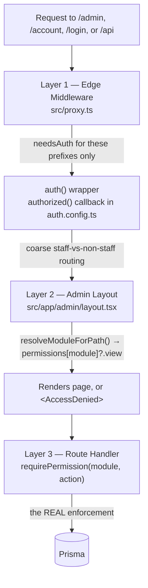

# 10 — Authentication & Authorization

> **What this section explains:** how a user proves who they are (NextAuth v5, three sign-in paths) and how the system decides what they're allowed to do (database-driven RBAC, enforced in three independent layers).
>
> **Confidence:** Confirmed from `.ai/context/tech-stack.md` → Authentication, `.ai/adr/0003-nextauth-three-layer-authorization.md`, and direct research of `src/lib/rbac.ts`, `src/lib/permissions.ts`, `src/proxy.ts`, `src/app/admin/layout.tsx`.

---

## Quick Reference

| | |
|---|---|
| Auth library | NextAuth v5 (`5.0.0-beta.31`) |
| Sign-in paths | Credentials (password) · Google OAuth · Google One Tap |
| Session adapter | `@auth/prisma-adapter` — `User`/`Session`/`Account` persisted in Postgres |
| Roles | `SUPERADMIN`, `ADMIN`, `DEVELOPER`, `SALES`, `EDITOR` (staff) + `CUSTOMER` |
| MFA | TOTP, required for `SUPERADMIN`/`ADMIN` only |
| RBAC modules | 32, defined in `src/lib/rbac.ts` |
| Enforcement | Three independent layers — see below |

## Three coexisting sign-in paths

1. **Credentials (password)** — staff and customer email/password login. Gated by a per-IP + per-account rate limiter and, when `TURNSTILE_SECRET_KEY` is set, a Turnstile challenge. Every failure collapses to the same generic `CredentialsSignin` error — the flow never reveals whether an email exists.
2. **Google OAuth (redirect)** — customer-only. The `signIn` callback rejects any staff role or disallowed email domain (`isAllowedGoogleDomain`) outright, and **never provisions a staff account**.
3. **Google One Tap** — modeled as a second Credentials provider (`id: "google-one-tap"`) rather than the OAuth redirect flow, so it reuses NextAuth's normal session issuance. The client widget posts a signed Google ID token; `auth.ts` verifies it server-side against Google's published JWKS via `jose` before trusting it.

Both Google paths funnel through the same shared `resolveGoogleCustomer()` helper, so the customer-only/domain rule is enforced identically either way — there is no code path where relaxing one path's check doesn't also need relaxing the other's.

Staff/admin accounts additionally support **TOTP MFA** as a second factor (`MFA_REQUIRED_ROLES = [SUPERADMIN, ADMIN]` in `src/lib/rbac.ts`).

## Authorization: three independent layers

**No single layer is trusted alone** — this is the point of ADR 0003. UI visibility is never treated as authorization.

### Layer 1 — Edge Middleware (`src/proxy.ts`)

- **Matcher**: all routes except static assets (`_next/static`, `_next/image`, favicon, common file extensions) and RSC prefetch requests (`next-router-prefetch`/`purpose: prefetch` headers).
- `needsAuth` is true **only** for paths starting with `/admin`, `/account`, `/api`, or exactly `/login`. Everything else (public ISR pages) skips NextAuth's session machinery entirely — deliberately, to prevent `auth()`'s `Set-Cookie` behavior from forcing every public page into dynamic SSR and breaking ISR caching.
- CSP is generated here (see §21) with a nonce for authenticated routes, a static precomputed CSP for everything else.
- `X-Robots-Tag: noindex, nofollow` is added for any request whose `Host` header isn't the literal production domain (defense-in-depth against a preview URL getting indexed).

Redirect logic itself (unauthenticated → `/login`, authenticated customer hitting `/admin/*` → `/account`) lives in the `authorized()` callback inside `auth.config.ts`, which `src/proxy.ts` routes qualifying requests through — the middleware file itself is the router, not where the redirect decision is made.

### Layer 2 — Admin Layout (`src/app/admin/layout.tsx`)

- Calls `auth()`; redirects to `/login` if no session or the role isn't staff.
- Fetches the full `PermissionMap` for the session's role via `getRolePermissions()`.
- `UNGATED_PATHS = ["/admin/mfa", "/admin/profile"]` — always reachable by any staff member regardless of module permissions (you must be able to reach MFA enrollment and your own profile even with zero other permissions).
- For every other path, resolves the route to a `ModuleKey` (`resolveModuleForPath()`, `src/lib/admin/moduleGuard.ts`) and checks `permissions[moduleKey]?.view`. If denied, renders `<AccessDenied moduleLabel={...}>` in place of the page — **this is a UX gate, not enforcement**.
- Sets `metadata.robots = { index: false, follow: false, nocache: true }` as additional defense-in-depth alongside `robots.ts`.

### Layer 3 — `requirePermission(module, action)` (real enforcement)

`src/lib/permissions.ts` (server-only — imports Prisma and NextAuth, must never be imported from middleware):

- `getRolePermissions(role)`: `SUPERADMIN` short-circuits to `fullPermissionMap()` (can never lock itself out). Every other role's permissions are read from `RolePermission` via an `unstable_cache`-wrapped fetcher (`revalidate: 300`, tag `"role-permissions"`, invalidated immediately by `revalidateTag` when a SUPERADMIN edits the roles matrix), and again wrapped in React's `cache()` so one request hits the DB at most once.
- `can(role, module, action)`: `true` immediately for `SUPERADMIN`; `false` for any non-staff role; otherwise a lookup into the cached map.
- `requirePermission(module, action)`: returns a `401` `NextResponse` if no session, `403` if `can()` is false, otherwise the authorized `Session`. Callers check `instanceof NextResponse` and return early — never call `auth()` a second time in the same handler.
- `requireStaff()`: the same shape for a route not tied to a specific module (e.g. uploads) — `401` if unauthenticated, `403` if the role isn't in `STAFF_ROLES`.

`SUPERADMIN` bypasses the `RolePermission` table entirely, inside these helpers — a route handler must never add a separate `if (role === "SUPERADMIN")` branch; that logic already lives centrally.

## RBAC module registry

`src/lib/rbac.ts` is deliberately **edge-safe** (no Prisma/NextAuth server imports), so it can be imported by both `src/proxy.ts` (middleware) and `auth.config.ts`. It defines:

- `Role = SUPERADMIN | ADMIN | DEVELOPER | SALES | EDITOR | CUSTOMER`
- `STAFF_ROLES` = everything except `CUSTOMER`
- `ACTIONS = ["view", "create", "edit", "delete"]`
- `MODULES` — **32 entries**, each `{ key, label, href }`. Full list in §27 (Admin/Dashboard Architecture), since it doubles as the admin sidebar's source of truth.

Adding a module means adding an entry to `MODULES` **and** seeding `RolePermission` rows for ADMIN/SALES/EDITOR in `prisma/seed.ts` — `SUPERADMIN`'s bypass means a module missing seed rows silently works when tested as SUPERADMIN and is completely locked out for every other role until `yarn db:seed` runs. This is the single most common mistake `.ai/skills/admin-crud.md` calls out.

## The public/account/admin data boundary

| Area | Path prefix | Auth | Data access |
|---|---|---|---|
| Public site | `src/app/(public)/` | None | Published records only, ISR |
| Customer account | `src/app/account/` | Any authenticated user | Own records (`where: { userId: session.user.id }`) |
| Admin CMS | `src/app/admin/` | Staff roles only | All records, no `published` filter |

Admin components (`src/components/admin/**`) never import from public-site component trees, and vice versa — enforced by convention/review, not a build-time boundary.

## Status transitions — where they're actually guarded

There is **no client-side `ALLOWED_TRANSITIONS` allow-list** in this codebase. Both `BookingsClient.tsx` and `LeadsClient.tsx` offer the full status enum in their UI control; the PATCH route validates the value is a legal enum member (Zod) but doesn't run a general state machine. Instead, specific transitions are special-cased server-side per model:

- `Booking.status = CANCELLED` — `PATCH /api/bookings/[id]` requires an admin role.
- `Lead.status = CONVERTED` — blocked entirely from the normal PATCH path; only reachable via the dedicated `POST /api/leads/[id]/convert` (which creates the `Booking` and locks the itinerary in one `$transaction`).

A new status value or transition-sensitive action needs a new server-side special case, never a client-side check alone.

## Related Documents

- `.ai/adr/0003-nextauth-three-layer-authorization.md`
- `.ai/context/tech-stack.md` → Authentication, Security
- `.ai/instructions/coding-standards.md` → Security
- §21 Security — CSP, rate limiting, MFA crypto detail
- §27 Admin / Dashboard Architecture — full `MODULES` table
- §14 CRM & Lead Management, §26 Core Business Flows — the lead-conversion transaction referenced above
