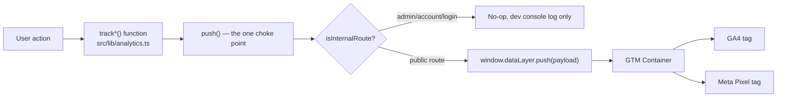
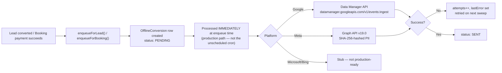

# 13 — Analytics & Tracking

> **What this section explains:** the complete analytics architecture — client-side (GA4/GTM/Meta Pixel) and server-side (Google Ads/Meta Conversions API) — and the hard line between the two that this codebase's own engineering skill exists to enforce.
>
> **Confidence:** Confirmed from `.ai/skills/analytics-event.md`, `docs/analytics.md` (existing team doc, read in full), and `.ai/context/business-rules.md` → Marketing Rules.

---

## The two separate mechanisms — do not conflate them

| | Client-side | Server-side |
|---|---|---|
| **Mechanism** | `window.dataLayer.push()` from the browser | A background upload from the server |
| **Tools** | GA4, GTM, Meta Pixel | Meta Conversions API, Google Ads Offline Conversions |
| **Independence** | Fires (or doesn't) based on browser/ad-blocker/ITP state | Fires regardless of whether the client-side pixel fired at all |
| **Where implemented** | `src/lib/analytics.ts` → `track*()` functions | `src/lib/offlineConversion/**` |

A business event (e.g. a booking) often needs **both**, called from two different places in the codebase. Implementing one does not implement the other — per `.ai/skills/analytics-event.md`, this is "the single most common mistake this Skill exists to prevent."

## Client-side pipeline

**GTM is the only script this codebase injects directly** (`GTMScript.tsx`). GA4 and the client-side Meta Pixel are configured as tags **inside** the GTM container — not hardcoded anywhere in this repo. Application code never calls `gtag()` or `fbq()` directly; every event goes through `push()` via a `track*()` function.

### The complete, real event list (authoritative — `AnalyticsEvent` in `src/types/analytics.ts`)

| Event | Fires when | Called from (example) |
|---|---|---|
| `lead_submit` | A lead/contact form submits successfully — never on validation error | `LeadForm.tsx`, `ContactForm.tsx` |
| `whatsapp_click` | Any WhatsApp CTA clicked (typed `source`) | `Footer.tsx`, `Navbar.tsx`, `ContactWhatsAppFloat.tsx` |
| `phone_click` | A `tel:` link clicked | `Navbar.tsx`, `Footer.tsx` |
| `email_click` | A `mailto:` link clicked | `Footer.tsx` |
| `package_view` | A tour/package detail page loads | `PackageViewTracker.tsx` |
| `inquiry_started` | Inquiry modal/tab opens | `TourDetailsSidebar.tsx` |
| `booking_started` | Checkout flow initiated | `BookingMobileBar.tsx` |
| `booking_completed` | Once, on the booking success page, after payment confirmed — the de facto purchase/conversion event (`value`, `currency`, `items`) | `BookingCompletedEvent.tsx` |

There is no `page_view`, `form_start`, or `payment_success` event — `booking_completed` is what plays the purchase-conversion role. Treat this table as the complete list, not illustrative.

### `whatsapp_click` sources (from `docs/analytics.md`)

| Source value | Where |
|---|---|
| `header` | Desktop Navbar "Plan My Trip" |
| `header_mobile` | Mobile FAB |
| `footer_cta` | Footer "Plan My Trip Free →" |
| `footer_social` | Footer social icon row |
| `float` | `ContactWhatsAppFloat` bottom-right bubble |
| `tour_sidebar` | Tour detail "Need Help?" sidebar |
| `booking_help` | Reserved, not yet wired |

## Server-side pipeline

- **`enqueueForLead(leadId)`** — called from the lead-conversion route, inside the same request, after the `$transaction` that creates the booking commits.
- **`enqueueForBooking(bookingId)`** — called after every successful online payment (webhook/verify-payment/reconcile).
- **Duplicate-conversion prevention**: a lead-converted booking that later takes an online payment (e.g. the remaining balance via Razorpay after a manually-recorded token) checks the booking's originating `Lead.bookingId` and skips any platform that lead already queued/sent — a real-world sale is never uploaded twice under two different ids. This is an application-level check, not something the database's independent `[leadId, platform]`/`[bookingId, platform]` unique constraints catch on their own.
- **Retry**: `OfflineConversion.attempts`/`lastError` — the one confirmed retry mechanism in the codebase (§28).

## Attribution capture

UTM parameters and ad-platform click IDs (`utmSource`, `utmMedium`, `utmCampaign`, `utmTerm`, `utmContent`, `gclid`, `gbraid`, `wbraid`, `fbclid`, `msclkid`, `landingPage`, `referrer`) are captured **once**, at `Lead` or direct-`Booking` creation, and never re-derived — a fixed capture point (`AttributionCapture.tsx` + `src/lib/attribution*.ts`), not something a new feature re-implements. A lead-converted booking copies its lead's attribution verbatim at conversion time rather than capturing it a second time.

A separate mechanism, `WhatsAppAttributionToken`, bridges attribution across a WhatsApp handoff — a visitor who clicks a `wa.me` link carrying a token can have that attribution reattached to a Lead they submit later (§08, §14).

## The three acquisition paths → one conversion upload each

Per `.ai/context/business-rules.md` → Marketing Rules:

1. **Website Lead** — Visitor → Lead Form → CRM → Sales follow-up → Booking created (staff "convert") → token/full payment → offline conversion.
2. **Direct Website Booking** — Visitor → Booking (checkout) → online payment succeeds → offline conversion.
3. **Manual CRM Lead** (staff-entered, ~10–20% of volume) — same downstream path as (1) from "Booking created" onward.

**Ad platforms see one real signal per sale, not every CRM status.** `NEW`/`CONNECTED`/`NOT_CONNECTED`/`QUALIFIED`/`NEGOTIATION`/`ON_HOLD` are internal sales-workflow states only — Google Ads/Meta are deliberately not given a per-status conversion action. Do not add per-status offline-conversion uploads without an explicit business decision to change this model.

## Debugging

In `development`, every `push()` call logs to the browser console: `[Analytics] { event: "whatsapp_click", source: "header" }`. In production, use GTM's own Preview mode to verify events; for a server-side conversion, confirm the corresponding `OfflineConversion` row reaches `SENT` (check `lastError`/`attempts` if it doesn't).

## Adding a new event (the process, for future reference)

1. Add the event shape to the `AnalyticsEvent` union in `src/types/analytics.ts`.
2. Add a `track*()` helper in `src/lib/analytics.ts`.
3. Call it from the component — never push a raw object to `dataLayer`.
4. Configure the matching GTM trigger/tag in the GTM web UI (outside this repository).

## Confirmed limitations

- **Not implemented**: server-side deduplication IDs beyond what Meta CAPI's own `event_id` mechanism provides (a real fix was made historically — "wire Lead `event_id` for Meta dedup," visible in git history — confirming this was a real, once-live bug now addressed).
- **No A/B testing or feature-flag-driven analytics** — not part of this system at all.
- **No data warehouse / BI layer** — GA4 and the admin Dashboard are the only two places aggregate numbers are visible; there is no exported analytics dataset.
- **Do not add a second, standalone Meta Pixel in app code** — a real historical attempt at this produced duplicate `PageView`/`Lead` events, because GTM's own Facebook Pixel tag already calls `fbq()` independently. If the browser-side Pixel needs an additional event, extend the `lead_submit` dataLayer push and wire it in GTM.

## What this section is NOT — internal sales-performance tracking

Everything above is **marketing/acquisition** analytics (how a visitor found VK, whether their visit became a sale). It's worth being explicit that VK has a second, entirely separate category of "tracking" that a reader might expect and that **does not exist**: internal sales-team performance analytics. Confirmed by repo-wide search — no sales leaderboard, no per-employee conversion-rate comparison, no quota/target tracking, no lead-response-time metric anywhere in the codebase.

The admin Dashboard (§27) does show a "Conversion Rate" KPI, but it's a single scoped aggregate (`paidCount / totalLeads` for whoever is looking — the whole org for an admin, one person's own leads for a SALES user), never a per-staff comparison. And `User.bookingConversionPct` — despite its name — is not a tracked metric at all; it's a manually-entered **commission-rate** field consumed only by the commission calculation at lead conversion (§14, §26), never displayed as a KPI or aggregated across staff. If "sales tracking" in the leaderboard/quota sense is a business need, it is genuinely unbuilt today, not merely under-documented.

## Related Documents

- `.ai/skills/analytics-event.md` — the full engineering pattern, including Common Mistakes
- `docs/analytics.md` — the team's existing GTM/GA4 quick reference
- §11 Third-Party Integrations — the Google Ads/Meta adapter deep dives
- §14 CRM & Lead Management, §26 Core Business Flows — where these events fire in the business flow
- §28 Background Jobs — the offline-conversion retry mechanism in full
