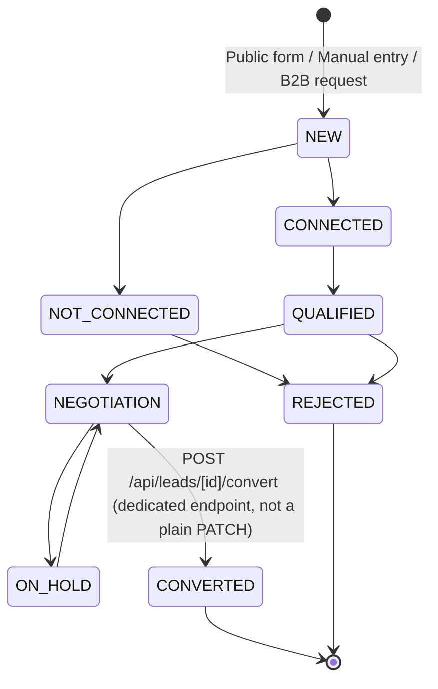
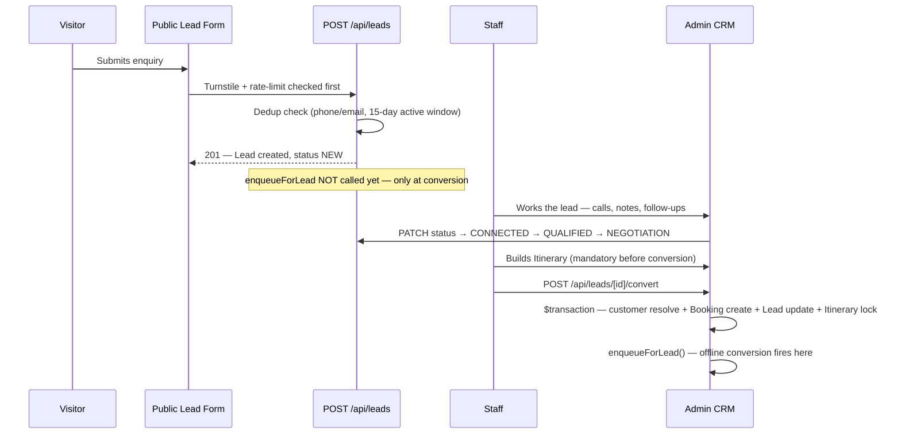

# 14 — CRM & Lead Management

> **What this section explains:** the lead pipeline — how a lead is created, deduplicated, worked by staff, and converted into a booking, plus how WhatsApp actually fits (or doesn't) into this system.
>
> **Confidence:** Confirmed from `.ai/context/business-rules.md`, `.ai/skills/crm-ticket.md`, and direct schema/route research (§08, §09).

---

## Lead lifecycle

`LeadStatus`: `NEW`, `CONNECTED`, `NOT_CONNECTED`, `QUALIFIED`, `NEGOTIATION`, `ON_HOLD`, `IN_PROGRESS`, `CONVERTED`, `REJECTED`. No separate "lost" status — `REJECTED`/`ON_HOLD` are the closest equivalents. `IN_PROGRESS` is not documented in `.ai/context/business-rules.md`'s lead-status list and appears (per schema research) to double as the B2B-request "pending" state — **requires verification** against current UI behavior (§35).

There is **no client-side transition allow-list** — the UI offers the full enum, and the PATCH route only checks the value is a legal enum member. The one hard-guarded transition is `CONVERTED`, which is blocked entirely from the normal PATCH path — reachable only via the dedicated conversion endpoint (§10, §26).

## Lead sources and categories

- **`LeadSource`**: `WEBSITE`, `MANUAL`, `GOOGLE_ADS`, `META_ADS`, `THIRD_PARTY`, `REFERRAL`. **No `WHATSAPP` or `PHONE_CALL` value** — a phone enquiry is logged as `MANUAL` or `THIRD_PARTY`.
- **`LeadCategory`** (trip-type tag, independent of source): `HONEYMOON_TOUR`, `COUPLE`, `FAMILY_TOUR`, `GROUP_TOUR`, `SKI_TOUR`, `OFFBEAT_TOUR`.

## Deduplication

A new public-form lead (`POST /api/leads`) is blocked if a lead with the same phone or email already exists, is in an "active" status (`NEW`/`CONNECTED`/`NOT_CONNECTED`/`QUALIFIED`/`NEGOTIATION`), and was created within the last **15 days**. A lead in `ON_HOLD`, `REJECTED`, or `CONVERTED` never blocks a fresh enquiry, regardless of age — the reasoning is that those statuses represent a closed episode, not an ongoing conversation a new enquiry would duplicate.

## Assignment and locking — the actual mechanics

Assignment is **entirely manual — there is no auto-assignment, round-robin, or load-balancing anywhere in the codebase.** A new public-form lead is created fully unassigned (`POST /api/leads` never sets `assignedToId`); it sits unowned until an admin picks an assignee from a plain `<select>` of staff users in the lead detail view.

**Ownership, once assigned, is strict** — this is the real shape of "how Sales work" and is enforced server-side, not just in the UI:

- **Reassigning** a lead is admin-only, always — `PATCH /api/leads/[id]` rejects an `assignedToId` change from a non-admin with `403`.
- **Everything else** on an assigned lead (status, notes, dates, negotiated amount, follow-up date) belongs **exclusively to the assignee** — not even an admin can edit it once it has an owner. The one exception: an **unassigned** lead is free-for-all to any admin (`canManage = isAssignee || (admin && lead.assignedToId === null)`).
- **A SALES-role user cannot even open another salesperson's lead detail page** — `GET /api/leads/[id]` returns `403` if `role === "SALES"` and the lead isn't theirs, regardless of URL. This is a harder boundary than most admin modules (§27), closer to the account-portal's own-data-only pattern than to typical staff-wide CRM visibility.
- Only the assignee may convert their lead into a booking.
- Every status/assignment/note/follow-up/attachment change is recorded as an immutable `LeadActivity` row — the lead's full history is never lost or overwritten.
- Once converted, a lead is `locked` — further edits are blocked until an admin explicitly unlocks it (`POST /api/leads/[id]/unlock`, Admin/Superadmin only). An admin may re-lock it afterward (`POST /api/leads/[id]/lock`), valid only for a `CONVERTED`, currently-unlocked lead.

**Assignment triggers a notification, both directions** (`src/lib/notifications.ts`, best-effort — failure never blocks the PATCH): the new assignee gets an in-app `LEAD_ASSIGNED` notification plus an email, deep-linking straight to the lead. On a *re*assignment, the outgoing assignee also gets a `LEAD_UNASSIGNED` notification in the same request — both fire from one PATCH call.

## Follow-ups — a real, if partial, worklist

`Lead.followUpAt` is a staff-set reminder date, changed via a datetime picker + "Set Follow-up"/"Clear Follow-up" button in the lead detail view, logged to `LeadActivity` (`FOLLOW_UP_SCHEDULED`) each time. An overdue follow-up renders in amber in the detail view.

List-wide, this surfaces as exactly one thing: a **"Today's Follow-ups"** KPI card on `/admin/leads`, counting leads with `followUpAt` falling today — scoped the same way as everything else (a SALES user's count is their own leads only, §27). **This card is not clickable and there is no dedicated filtered view** — `LeadsClient.tsx`'s own filters are limited to status, source, and (admin-only) assignee; there's no "sort by follow-up date" or "show overdue" filter. A salesperson sees *how many* follow-ups are due today, not a one-click list of *which* leads they are. This is a real, named gap (§35), not a documentation oversight.

## Hotel Rates — Sales' supplier rate book

`HotelSupplier` (`/admin/hotel-suppliers`, RBAC key `hotelSuppliers`) is a distinct tool from the Lead/Booking pipeline above but squarely a Sales instrument: a private reference table of hotel net rates (EP/CP/MAP by room type, per destination) that a salesperson consults while preparing a quotation or itinerary — **not** bookable customer-facing inventory, and not linked to `Booking` at all (§08).

**Data shape**: one row per hotel, one *current* rate (no history — a season's rate is simply overwritten). `category` (Budget/3★/4★/5★) is **not manually chosen** — it's auto-computed from the Deluxe room's MAP rate (≤₹2,000 → Budget, ≤₹3,500 → 3★, ≤₹7,000 → 4★, else 5★) on every save. `recommended` hotels are starred and always sorted first; `bookingsCount` is a manually-entered tally (not derived from real bookings) staff use as an informal trust signal.

**The rate-refresh cycle**: `rateNeedsRefresh()` is true when a hotel has no MAP rate, no `validTo` date, or `validTo` has lapsed — this single function gates the "Request Rates" button client-side and is independently re-checked server-side (`POST /api/hotel-suppliers/[id]/request-rates`, `hotelSuppliers.edit`), so it can't be bypassed from devtools. Sending a request:

- Emails the hotel (from `sales@vertexkashmirholidays.com`, **BCC to `admin@vertexkashmirholidays.com`** automatically) asking for updated rates, with the subject `Rate Request — <hotel name>`.
- Builds the body from VK's own company profile (trade name, legal name, GST, tourism registration number, **operational/corporate office address — deliberately not the legal registered office**, since this is external partner-facing mail) and the sending staff member's name.
- **Attaches VK's Tourism Registration PDF** so the supplier can verify VK is a registered J&K tour operator — best-effort; a missing file never blocks the send.
- Stamps `lastRateRequestSentAt`, which is what flips the request back to "needs refresh" once `validTo` lapses again.

**The Excel export — the other direction**: `buildHotelExportWorkbook()` (`src/lib/hotelSuppliers/export.ts`) is explicitly, per its own code comment, "the exact rate-sheet layout Sales shares externally" — one sheet per destination, one block per hotel (Name/Phone/Email/Map/Valid, then a Room Type/CP/MAP table). Staff multi-select hotels (selection persists across tab/filter changes) and export a `hotel-rates-<date>.xlsx` — the formatted artifact a salesperson hands to a customer or B2B agent. So the module both **ingests** rates from suppliers (the request-rates email) and **outputs** a curated, presentable rate sheet to sell against — a small but complete two-way workflow that has nothing to do with the Lead/Booking pipeline's own data model.

A name-free aggregate (`isActive` hotel count) is also surfaced publicly as a "verified properties" trust signal on the homepage and destination pages (`src/lib/hotelSuppliers/stats.ts`) — the one point of contact between this internal tool and the public site.

## Staff workflow

Itinerary is **mandatory before conversion** — enforced server-side (`ITINERARY_REQUIRED` error), not just a UI nudge. Full conversion transaction detail in §26.

## B2B as a lead-pipeline variant

A B2B quote request is modeled as a `Lead` row with `b2bAgentId` set — the only schema-level discriminator between a normal lead and a B2B request (there is no separate `B2BRequest` model). B2B-specific fields (`days`, `rooms`, `budget`) exist directly on `Lead`, populated only for this variant. B2B agents self-register (OTP-verified, `B2BAgentStatus`: PENDING → ACTIVE → SUSPENDED) and manage their own requests through `/account/requests` (§09's `/api/account/b2b/**` routes), while staff work the admin side through `/admin/b2b-requests` and `/admin/b2b-agents`.

## WhatsApp — click-to-chat only, not a CRM integration

Confirmed directly from `src/lib/whatsapp.ts`: WhatsApp integration in VK is **entirely `wa.me` click-to-chat links** — `buildWhatsAppHref(number, message)` strips non-digit characters and builds a plain `https://wa.me/<digits>?text=<encoded>` URL. There is **no WhatsApp Business API** (Cloud API, two-way messaging webhooks), no Twilio, and no CRM sync of WhatsApp conversations. Consumed as plain `<a href>` links across the Navbar, Footer, tour sidebar, and floating contact bubbles.

The one piece of engineering sophistication here is **attribution bridging**: `appendWhatsAppAttributionTag()` appends a `[Ref: <tag>]` string to the prefilled message text, and a separate `WhatsAppAttributionToken` model lets a click's UTM/click-ID context survive the handoff to WhatsApp and be reattached if that visitor later submits a Lead — pure string manipulation and a database row, not an API integration with WhatsApp itself.

This directly explains why `LeadSource` has no `WHATSAPP` value (§02): a WhatsApp conversation isn't captured as structured lead data automatically — a human sales rep manually creates the resulting `Lead` (typically as `MANUAL` or `THIRD_PARTY`) after the conversation happens.

## Reporting and sales performance — what does NOT exist

There is **no standalone Reports module**, and — worth stating directly, since it's a natural question about any CRM — **no sales leaderboard, no per-salesperson conversion-rate comparison, and no quota/target tracking anywhere in the codebase** (confirmed by repo-wide search; §13, §27, §35). The admin Dashboard (full widget inventory in §27) is real and useful but is **role-scoped, not comparative**: a SALES user's Dashboard silently filters every number (revenue, bookings, leads, conversion rate) to their own assigned leads — each salesperson effectively gets a personal dashboard, with no admin-side view that ranks or compares staff against each other.

**A naming trap worth flagging explicitly**: `User.bookingConversionPct` sounds like a tracked performance metric but is actually a **manually-set commission-rate configuration field** (§26 Flow 4, §08) — edited once per employee on the Employees page, consumed only by the commission calculation at lead-conversion time. It is never computed from real conversion data, never displayed as a KPI, and never aggregated. Don't infer "VK tracks each salesperson's conversion percentage" from this field's name.

## Related Documents

- `.ai/context/business-rules.md` §1 — the authoritative lead business rules
- `.ai/skills/crm-ticket.md` — how a CRM ticket is scoped before implementation
- §08 Database Architecture — `Lead`, `LeadActivity`, `HotelSupplier`, `WhatsAppAttributionToken` schema
- §13 Analytics & Tracking — `lead_submit` client event, `enqueueForLead` server conversion, and the absence of sales-performance analytics
- §26 Core Business Flows — the full lead-to-booking sequence diagram
- §27 Admin / Dashboard Architecture — the full Dashboard widget inventory and SALES role-scoping mechanism
- §35 Technical Debt — the follow-up worklist gap and the `bookingConversionPct` naming trap
