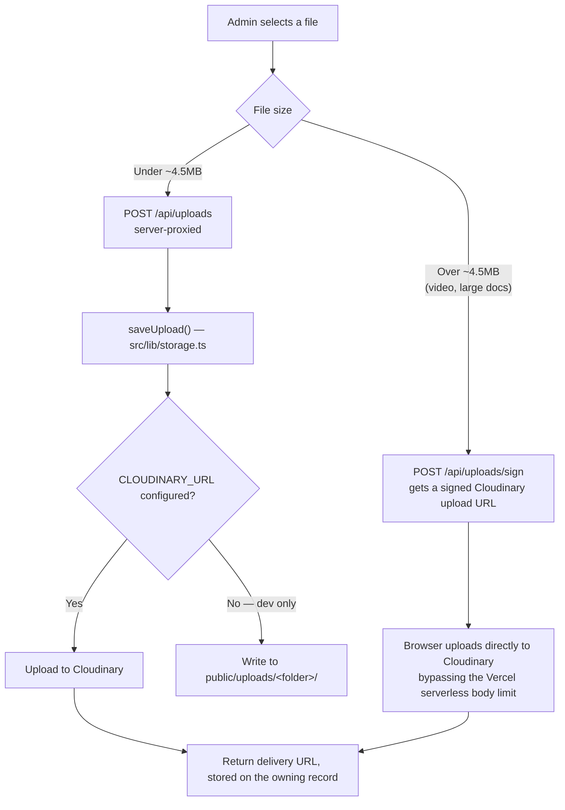

# 15 — Media / Storage / CDN

> **What this section explains:** how images, videos, PDFs, and other files are uploaded, stored, transformed, and delivered.
>
> **Confidence:** Confirmed from `.ai/context/tech-stack.md` → File Storage, `next.config.ts` image config, and the integration research in §09/§11.

---

## Quick Reference

| | |
|---|---|
| Storage provider | **Cloudinary** (production); local filesystem fallback (dev only) |
| Image optimization | `next/image` + `sharp` |
| Upload paths | Server-proxied (`/api/uploads`) and signed direct-browser (`/api/uploads/sign`) |
| Upload validation | Magic-byte validated for **images**; video/document validation is a confirmed gap |

## Storage architecture

**Why the split exists:** Vercel serverless functions cap request bodies around 4.5MB. Video uploads (and some large images) exceed that, so `/api/uploads/sign` signs a direct browser→Cloudinary upload instead — the file never passes through VK's own server at all for this path. This constraint is explicitly called out in `src/proxy.ts`'s CSP comments as a real, load-bearing reason for the signed-upload path existing (§18).

## `saveUpload()` — the one seam

Every caller speaks only in terms of a `folder` + returned `url` — **no route calls the Cloudinary SDK directly**. This is the practical instance of ADR 0005's adapter pattern applied to storage: a future migration to another media host would touch `src/lib/storage.ts` once, not every upload call site across the codebase.

- **Production**: `CLOUDINARY_URL` (or discrete `CLOUDINARY_CLOUD_NAME`/`API_KEY`/`API_SECRET`) configured → uploads go to Cloudinary, namespaced under `CLOUDINARY_FOLDER` (default `vertexkashmir`) to separate environments (dev vs. prod media, if both point at the same Cloudinary account).
- **Local dev fallback**: unconfigured → writes to `public/uploads/<folder>/` on the local filesystem. This is explicitly a dev-only convenience — Vercel's production filesystem is read-only, so this path **cannot** work in any deployed environment, making `CLOUDINARY_URL` a de facto hard requirement for any deployed environment despite being marked "optional" in the strict boot-crash sense (§19).

## Validation

Uploaded images are **magic-byte validated server-side** (checking actual file content, not just the declared MIME type or extension) before being accepted. **Confirmed gap**: video and document upload types do not yet have the same magic-byte validation — tracked as a known engineering-backlog item (§21, §35), not silently assumed safe.

## Image optimization pipeline

- **`next/image`** project-wide on the public site, backed by **`sharp`** (registered under `serverExternalPackages` in `next.config.ts` — removing that breaks Vercel builds).
- **Formats**: AVIF and WebP (`next.config.ts` → `images.formats`).
- **Cache**: `minimumCacheTTL: 2678400` (31 days).
- **Allowed remote hosts** (`remotePatterns`): the configured placeholder-image host, `res.cloudinary.com`, and `i.ytimg.com` (YouTube thumbnails).
- **SVG handling**: allowed (`dangerouslyAllowSVG: true`) but served under a locked-down `contentSecurityPolicy` scoped to the image endpoint itself (`default-src 'self'; script-src 'none'; sandbox;`), preventing an uploaded SVG from executing script even if it contained one.
- A handful of campaign marketing components still use a raw `` instead of `next/image` — a named, tracked gap (§03, §35), not a systemic pattern.

## PDF generation (a form of "media" worth noting here)

`@react-pdf/renderer` generates itinerary exports, booking invoices, and salary slips (`src/lib/pdf/`, `src/lib/bookings/invoice-pdf.tsx`, `src/lib/salary/salary-slip-pdf.tsx`) — these are rendered documents, not stored media; they're generated on demand server-side and streamed to the requester, not persisted in Cloudinary.

## Vertex Connect chat attachments

Chat messages (`ChatMessage.attachmentUrl`/`attachmentPublicId`/`attachmentType`) also flow through Cloudinary, with a distinct lifecycle from catalog/content media: attachments older than 90 days are purged by the `connect-retention` cron alongside their message rows (§28) — the only place in the system with an automated media-deletion policy.

## Related Documents

- `.ai/context/tech-stack.md` → File Storage
- ADR 0005 — the adapter pattern this storage layer follows
- §11 Third-Party Integrations — the Cloudinary deep-dive (failure behavior, vendor lock-in)
- §18 Infrastructure & Hosting — the Vercel read-only-filesystem constraint driving this design
- §21 Security — upload magic-byte validation, the video/document gap
- §28 Background Jobs — the Vertex Connect 90-day media retention purge
