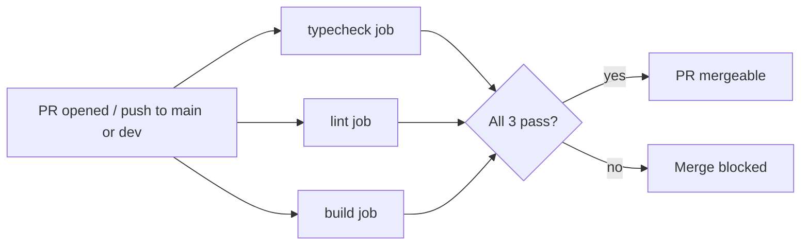
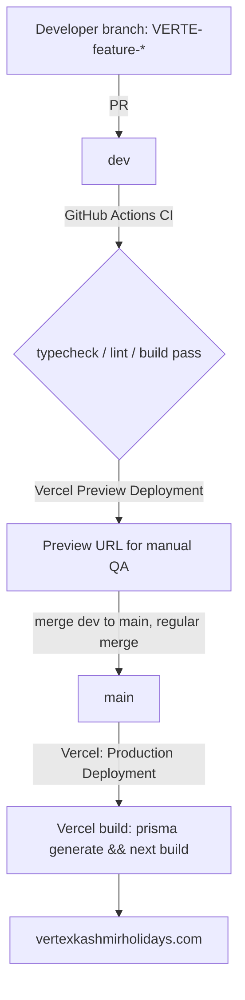

# 20 — CI/CD & Deployment

> **What this section explains:** the exact path a commit takes from a developer's machine to production — CI checks, deploy triggers, and rollback procedure for both an application-code regression and a bad schema migration.
>
> **Confidence:** Confirmed from `.github/workflows/ci.yml`, `next.config.ts`, `package.json` scripts, `vercel.json`, and `.ai/instructions/git-workflow.md`.

---

## Quick Reference

| | |
|---|---|
| CI | GitHub Actions, one workflow (`ci.yml`), three parallel jobs |
| Deploy trigger | Automatic on push/merge to `main` (production) and every branch/PR (Preview) |
| Build command | `prisma generate && next build` — **not** `prisma migrate deploy` |
| Migrations | A separate, deliberate, manual step — never automatic on deploy |
| Branch strategy | `main` (production) ← `dev` (integration) ← `VERTE-<type>-*` working branches |

## CI (`.github/workflows/ci.yml`)

Three parallel jobs run on every `pull_request` and `push` to `main`/`dev`, Node 24, Yarn (frozen lockfile):



| Job | Steps | Notes |
|---|---|---|
| **typecheck** | checkout → setup-node 24 → `yarn install --frozen-lockfile` → `yarn prisma generate` → `yarn typecheck` (`tsc --noEmit`) | Needs only schema parsing — a dummy `DATABASE_URL` is enough, no live connection |
| **lint** | same setup → `yarn lint` (`eslint .`) | Same DB requirement as typecheck |
| **build** | same setup, **plus** a real `postgres:16` service container → `yarn prisma migrate deploy` → `yarn build` | A real, migrated database is required here specifically because `next build` calls `generateStaticParams` on several public pages (tours, destinations, blog, etc.) that query Prisma directly during the build — a dummy connection string is insufficient for this job only |

**No test step exists in CI** — no `yarn test`/Vitest/Playwright run is wired into `ci.yml`, despite Storybook/Vitest tooling now being present in `package.json` (§04, §24). This is a real, current gap, not an oversight in this documentation.

Branch protection on `main` requiring these checks is a manual, one-time GitHub setting (per `.ai/context/tech-stack.md`) — not itself expressed in the workflow file. **Requires verification** whether it's currently enabled (not inspectable from a local checkout).

No separate deploy job exists in `ci.yml` — deployment is Vercel's own GitHub integration, triggered independently of the Actions workflow.

## Branch Strategy (`.ai/instructions/git-workflow.md`)

- **`main`** — production. Every live deploy builds from this branch.
- **`dev`** — integration branch. Every feature/bugfix branch merges here first; `dev` is periodically merged into `main` once verified.
- **Working branches** — a single flat prefix, no nested `type/` folder (matches ~90 branches of existing repo history): `VERTE-feature-*`, `VERTE-bugfix-*`/`VERTE-fix-*`, `VERTE-chore-*`, `VERTE-docs-*`, `VERTE-perf-*`.

Commit convention: Conventional Commits, `type(VERTE-N): message` (e.g. `fix(VERTE-54): resolve payment calculation`). Emergency fixes may omit a scope.

Merge strategy: feature/bugfix → `dev` is **Squash and Merge**; `dev` → `main` is a **regular merge** (not squashed), so `main`'s history shows what shipped together in each release.

## Deployment Pipeline



- **Trigger**: automatic on every push/merge to `main` (production); every branch/PR gets its own Vercel **Preview Deployment** URL.
- **Build command**: `prisma generate && next build` — this runs Prisma client codegen only, **not** `prisma migrate deploy`. Schema migrations against production are a **separate, deliberate, manual step** — they never run automatically as part of a deploy (see §08 Database Safety, §31, §32).
- **Runtime**: Vercel Serverless Functions for Route Handlers/dynamic pages; Vercel Edge Middleware for `src/proxy.ts`.
- **Scheduled jobs**: one Vercel Cron entry (`/api/cron/connect-retention`, daily 02:00 UTC) — see §28 for the full cron picture, including the two routes that exist but aren't Vercel-scheduled.

Deployment is automatic on merge to `main` — developers should not manually deploy unless required. Vercel Cron jobs run independently of the deploy pipeline and need no manual step.

## Rollback

A bad deploy to `main` has two possible causes, requiring different responses.

### Application-code regression (no schema change)

1. Vercel dashboard → Deployments → "Promote to Production" on the last known-good deployment — fastest path, live in seconds, no git operation required.
2. **In parallel** (not instead of): `git revert <bad-commit>` on a branch, merged as a normal PR — so `main`'s history stays correct for the next deploy. The dashboard rollback buys time; the git revert is the real fix.
3. Merge the same revert into `dev` too — otherwise the next `dev → main` merge reintroduces the bug.

### A schema migration shipped in the same deploy

Vercel's dashboard rollback only reverts **application code** — it does not undo a Prisma migration that already ran against production (the build step runs `prisma generate`, not `prisma migrate deploy`; migrations are a separate deliberate step, per above).

1. Confirm whether the migration is actually the problem, or just coincidentally shipped in the same deploy: `npx prisma migrate status` against production.
2. If the migration needs undoing: write and apply a **new forward migration** that reverses the change (`prisma migrate dev` locally to generate it, review the SQL, apply to production). Prisma Migrate has no down-migration mechanism — never hand-edit or delete an already-applied migration file.
3. Only roll back application code once the data/schema side is confirmed safe — rolling back code while a half-migrated schema is in place can be worse than the original bug.

**When in doubt, slow down** — a wrong database-side rollback is far harder to undo than a wrong code-side rollback. Full runbook detail in §32.

## Hotfix Workflow

```
Production issue → branch from main → implement → verify → merge to main AND dev → deploy → Plane task afterward if needed
```

A hotfix branched from `main` must also be merged back into `dev`, or the fix is lost on the next `dev → main` merge.

## Rules

**Never**: force push to `main`/`dev`, rewrite production history, commit secrets, commit generated build files or `node_modules`, commit debugging code, skip hooks (`--no-verify`) without explicit instruction.

**Always**: pull latest before starting work, keep commits focused, keep branches short-lived (delete once merged).

## AI-Assisted Development

Per `.ai/instructions/git-workflow.md`: the same engineering standards, review process, and verification checklist apply regardless of whether code is human- or AI-written. An AI assistant commits locally for review; it does not push to a shared branch or open/merge a PR unless explicitly instructed to.

## Related Documents

- `.ai/instructions/git-workflow.md` — the full source for this section
- `.ai/skills/prisma-migration.md` → Database Safety
- §08 Database Architecture, §19 Environments & Configuration
- §31 Disaster Recovery, §32 Operational Runbooks — the applied rollback/migration procedure in incident form
