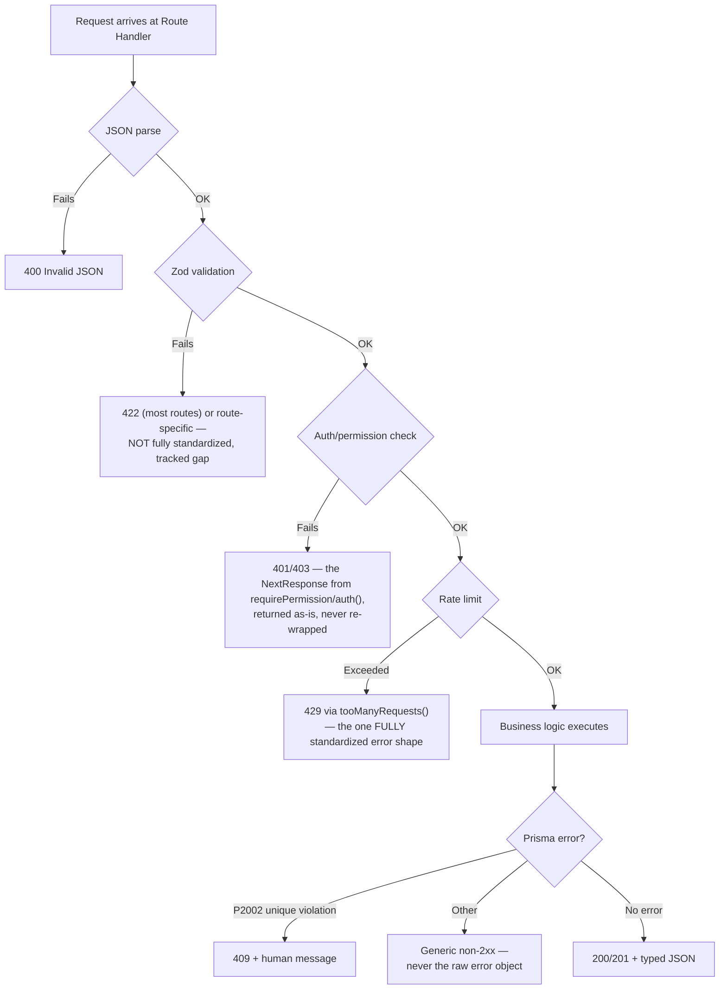

# 23 — Error Handling

> **What this section explains:** how errors are handled on both the frontend and backend — what's caught, what's shown to the user, and where the coverage is intentionally narrow.
>
> **Confidence:** Confirmed from direct research of `src/app/error.tsx`/`not-found.tsx` (the only two special error files in the repo), `.ai/instructions/architecture.md` §11, and the API-route error conventions underlying §09.

---

## Frontend error boundaries — narrow by design, not oversight

Only **two** special error files exist in the entire application, both at the root `src/app/` level, shared across every route group (public, admin, account, login):

- `src/app/error.tsx` — catches a rendering/runtime error anywhere beneath it.
- `src/app/not-found.tsx` — the 404 page.

**No per-route `error.tsx`/`not-found.tsx` overrides exist anywhere**, and **no `global-error.tsx`** exists (the file that would catch an error in the root layout itself, replacing the entire page including `<html>`/`<body>`). This means:

- A rendering error on, say, a specific tour detail page falls through to the same generic error boundary as a rendering error in the admin panel — there's no route-specific "here's what went wrong with this booking" recovery UI.
- An error thrown *by the root layout itself* (e.g. a failure in the `SiteSettings` fetch that every public page depends on) has **no boundary to catch it** — this is a real, confirmed gap worth naming explicitly, not a theoretical one.

## Backend error-flow

- **Invalid JSON body** → `400`.
- **Validation failure** → most routes return `422`, but this is **not fully standardized** — a named, tracked engineering-backlog item ("Standardize API Response & Status Codes"), not a settled convention. A new route should match whatever sibling routes in the same domain already do.
- **Auth/permission failure** → the `NextResponse` returned directly by `requirePermission`/`requireStaff`/`auth()` (401/403) — returned as-is, never wrapped further.
- **Rate-limit rejection** → `429` via `tooManyRequests()` — this **is** fully standardized, the one clean exception to the paragraph above.
- **Not found** → `404` with a short message.
- **Unexpected error** → a generic message, non-2xx status, never the raw error object or a stack trace exposed to the client.

## Graceful degradation for non-critical failures

A failed non-critical step never fails the primary operation — the concrete, repeated example throughout this codebase is `sendMail()` (`src/lib/mail.ts`): it throws when SMTP env vars are unconfigured, and every caller catches that and logs it rather than failing the booking/lead/user action it was a side effect of. This is the same graceful-degradation philosophy as ADR 0005's `isConfigured()` pattern, applied to error handling rather than configuration.

## Retry — narrow, not a general pattern

The **only** confirmed retry mechanism in the entire codebase is `OfflineConversion.attempts`/`lastError` (§13, §28). Do not assume a failed Cloudinary upload, a failed Razorpay call, or a failed SMTP send retries itself anywhere else — each of those fails once, is caught, logged, and (per the graceful-degradation rule above) does not block the primary operation, but nothing automatically tries again.

## User-facing error messages

API error responses are deliberately short and human-readable — "Failed to save changes," not a raw Prisma constraint-violation string or a gateway's internal error code. On the frontend, the standard mutation pattern (§06) surfaces this via `toast.error(message)` — paired with `toast.success(message)` on the happy path, both via Sonner.

## Related Documents

- `.ai/instructions/architecture.md` §11 — the source principles this section documents
- `.ai/skills/api-route.md` → Error Handling — the per-route convention detail
- §06 Frontend Architecture — the `loading.tsx` coverage (32 files) contrasted against this section's narrow `error.tsx` coverage (2 files)
- §09 API Architecture — every route's specific error behavior
- §33 Troubleshooting — practical symptom-to-cause mapping when an error surfaces
- §35 Technical Debt — the missing `global-error.tsx` and unstandardized validation-error status codes, as tracked items
