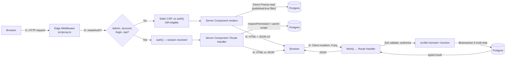
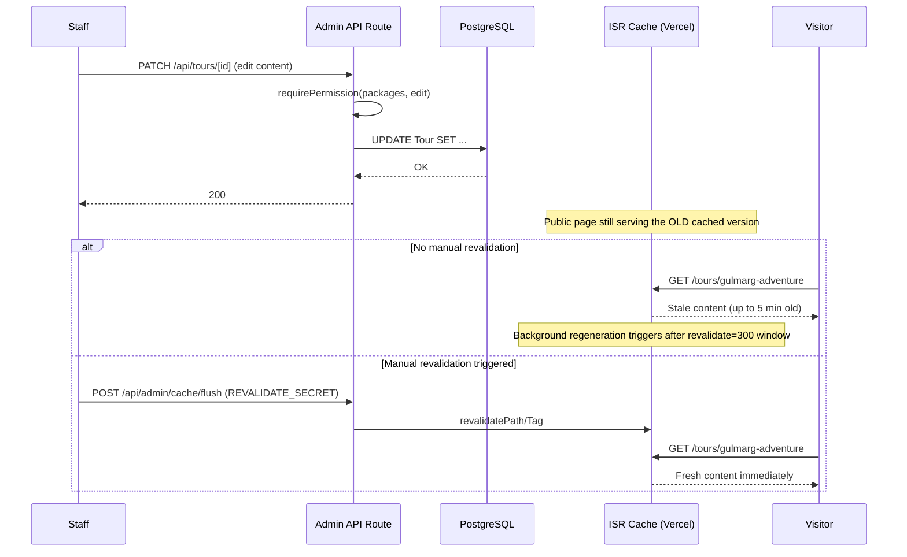
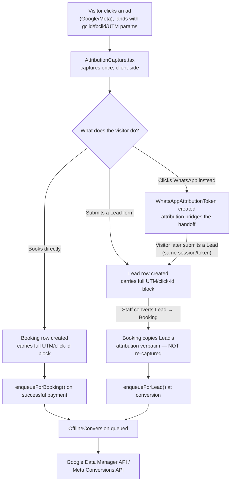
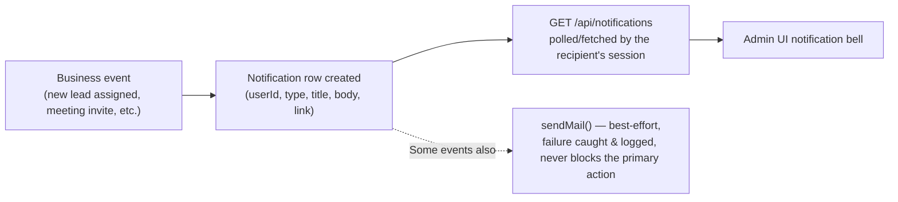

# 25 — Data Flows

> **What this section explains:** end-to-end data flow diagrams for the system's structural patterns — the general request flow, the ISR content-publish flow, and the analytics/attribution flow — as distinct from §26, which covers the specific business-process flows (lead→booking, payment) in full sequence-diagram detail.
>
> **Confidence:** Confirmed from the architecture, auth, caching, and analytics sections already documented; synthesized here as cross-cutting diagrams.

---

## General request → response data flow

This is the same flow described narratively in §03; here it's shown as the concrete path data takes, annotated with where auth/caching decisions branch it.

## Content-publish data flow (admin edit → public visibility)

A content edit is not instantly public — up to a 5-minute ISR window applies unless the admin explicitly flushes the cache (§17).

## Marketing attribution data flow

Attribution is captured **exactly once**, at the point of Lead or direct-Booking creation, and is never re-derived downstream — a deliberate, fixed capture point (§13).

## Notification data flow (internal)

## Related Documents

- §03 Architecture — the narrative version of the general request flow
- §17 Caching & Performance — the ISR mechanics behind the content-publish flow
- §13 Analytics & Tracking, §14 CRM & Lead Management — the attribution flow in full business context
- §26 Core Business Flows — the lead→booking→payment flow in full sequence-diagram detail (the complement to this section)
- §28 Background Jobs — where `enqueueForLead`/`enqueueForBooking` actually process
