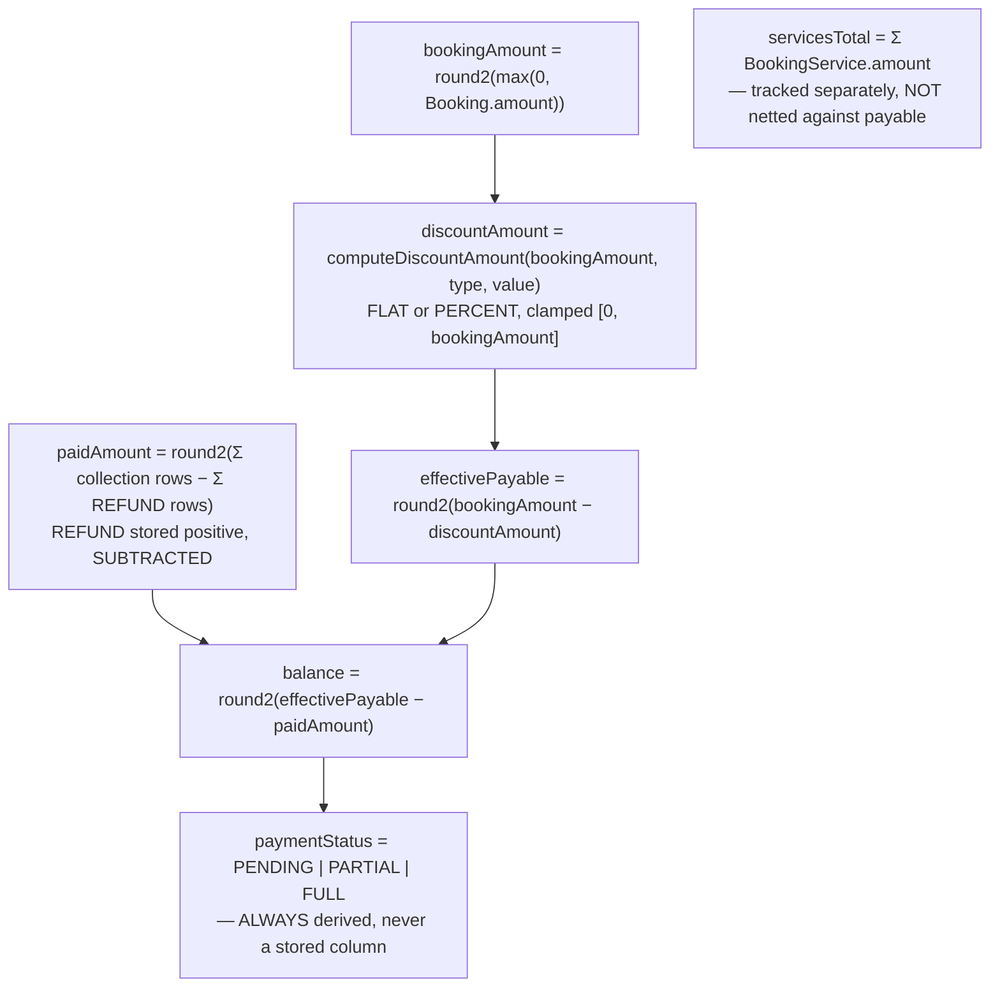
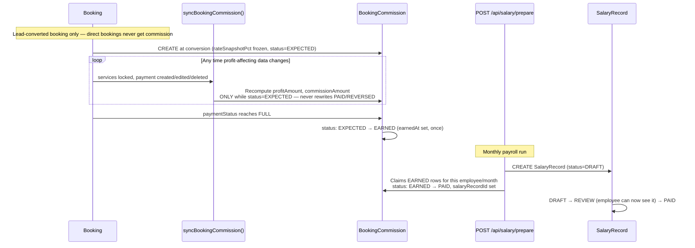

# 26 — Core Business Flows

> **What this section explains:** the major user journeys, end to end, with sequence diagrams — lead-to-booking conversion, the two payment lifecycles, and the commission/payroll chain that follows a booking through to a salesperson's paycheck.
>
> **Confidence:** Confirmed from `.ai/context/business-rules.md`, `.ai/skills/booking-finance.md`, `.ai/skills/crm-ticket.md`, and the schema/route research underlying §08/§09/§14.

---

## Flow 1 — Lead capture → conversion → booking

```mermaid
sequenceDiagram
    participant V as Visitor
    participant Form as LeadForm.tsx
    participant API as POST /api/leads
    participant Staff
    participant Convert as POST /api/leads/[id]/convert
    participant DB as PostgreSQL ($transaction)
    participant Conv as enqueueForLead()

    V->>Form: Fills lead form
    Form->>API: Turnstile + rate limit checked first (cheapest-path rejection)
    API->>API: Dedup check — same phone/email, active status, <15 days?
    alt Duplicate found
        API-->>Form: Blocked
    else No duplicate
        API->>DB: INSERT Lead (status: NEW)
        API-->>Form: 201
        Form->>Form: trackLeadSubmit() — client analytics event
    end

    Staff->>Staff: Works lead — status NEW→CONNECTED→QUALIFIED→NEGOTIATION
    Staff->>Staff: Builds Itinerary (mandatory — ITINERARY_REQUIRED if missing)
    Staff->>Convert: POST /convert (negotiatedAmount, tokenAmount)
    Convert->>Convert: requirePermission(leads, edit); tokenAmount < negotiatedAmount check
    Convert->>DB: BEGIN $transaction
    DB->>DB: resolveLeadCustomer — match by email, then phone (staff-vetted path)
    DB->>DB: CREATE Booking (amount=negotiatedAmount, no tourId)
    DB->>DB: UPDATE Lead (status=CONVERTED, locked=true, bookingId=...)
    DB->>DB: UPDATE Itinerary (locked=true, status=CONFIRMED)
    DB->>DB: buildServicesFromItinerary() — BookingService rows seeded at ₹0
    DB->>DB: INSERT BookingPayment (type=TOKEN, amount=tokenAmount, +GST if non-cash)
    DB->>DB: IF employee has bookingConversionPct → CREATE BookingCommission (status=EXPECTED)
    DB-->>Convert: COMMIT
    Convert->>Conv: enqueueForLead(leadId) — AFTER commit, outside the transaction
    Conv-->>Convert: OfflineConversion row queued, processed immediately
    Convert-->>Staff: 200 — Booking created
```

**Key rules embedded in this flow** (§02, §14): the whole database mutation sequence is **one Prisma `$transaction`** — customer resolution, booking creation, lead update, and itinerary lock either all succeed or all roll back together. `enqueueForLead` fires *after* the transaction commits, not inside it (an offline-conversion queue entry for a booking that got rolled back would be a real bug). The token amount must be strictly less than the negotiated amount. Services start at ₹0 because the itinerary carries no internal cost data — staff fills in real costs afterward.

## Flow 2 — Direct website booking (online payment)

```mermaid
sequenceDiagram
    participant V as Visitor
    participant Tour as Tour Detail Page
    participant Create as POST /api/bookings/create-order
    participant RP as Razorpay
    participant Verify as POST /api/bookings/verify-payment
    participant Hook as POST /api/bookings/webhook
    participant DB as PostgreSQL

    V->>Tour: trackBookingStarted() — clicks Book Now
    Tour->>Create: paymentOption: ADVANCE | FULL (no amount sent)
    Create->>Create: computeChargeable(tour.priceFrom, option) — SERVER computes amount
    Create->>DB: CREATE Booking (status=PENDING) + Razorpay order
    Create-->>Tour: order_id, amount (server-computed)
    Tour->>RP: Opens Razorpay checkout.js widget
    RP-->>V: Customer pays
    RP-->>Verify: Client-side callback (razorpay_payment_id, razorpay_signature)
    Verify->>Verify: HMAC-SHA256(RAZORPAY_SECRET, order_id|payment_id) === signature?
    alt Signature valid
        Verify->>DB: recordOnlinePayment() — booking status=PAID, BookingPayment row ($transaction)
        Verify->>V: trackBookingCompleted() — client conversion event
        Verify->>DB: enqueueForBooking(bookingId)
    else Signature invalid or callback never fires (browser closed)
        Note over Hook: Webhook is the safety net
        RP->>Hook: Server-to-server payment.captured / order.paid event
        Hook->>Hook: HMAC-SHA256(RAZORPAY_WEBHOOK_SECRET, rawBody) vs x-razorpay-signature<br/>(crypto.timingSafeEqual)
        Hook->>DB: recordOnlinePayment() — same idempotent path
        Hook->>DB: PaymentAudit row (gateway event trail)
    end
```

**Why both `verify-payment` and `webhook` exist**: the client-side callback (`verify-payment`) is the fast path — it confirms payment the instant the browser is still there. The webhook is the reconciliation safety net for when it isn't (browser closed mid-redirect, network drop) — Razorpay calls it server-to-server regardless of what the client does. Both converge on the same `recordOnlinePayment()` function, so the booking reaches `PAID` exactly once no matter which path gets there first (§07's transaction-atomicity note applies here).

**Stale abandoned bookings**: a `PENDING` booking with `create-order` called but no payment ever completed is cleaned up by `cleanupStalePendingBookings()` (`src/lib/bookings/cleanup.ts`), triggered inline from the *next* `create-order` call on live traffic — not (currently) by the `stale-bookings` cron route, which exists as a manual/backup sweep only (§28).

## Flow 3 — Booking finance, the single computed chain

Per `.ai/skills/booking-finance.md`, computed in `computeBookingFinance()`, in this exact order — every caller (API, admin UI, invoice PDF) imports this one function rather than recomputing any of it:



**GST is a separate, payment-level calculation** (`resolveGst()`) — applies only to non-cash payment methods, computed as `paymentAmount × gstPercent / 100` and persisted on that one `BookingPayment` row for reporting. **It never enters the payable/balance formula above** — this is the single most commonly-misunderstood rule in the whole financial model, per the skill document's own framing.

A payment can never exceed the remaining `balance` — **except** a `REFUND`-type payment, which is explicitly excluded from that check (a refund isn't a collection against the payable, it's a reduction of what was collected). Any caller that feeds payments into `computeBookingFinance` must select the `type` column alongside `amount`, or a refund silently gets miscounted as a fresh collection.

## Flow 4 — Booking commission → salary



**Commission profit formula** (`src/lib/bookings/commission.ts`): `Commissionable Profit = effectivePayable − servicesTotal − GST deduction` (GST taken from the actual recorded `gstAmount` per payment, not a hardcoded rate; REFUND rows subtract GST back out). `rateSnapshotPct` is frozen at the moment the `BookingCommission` row is created — a later change to the employee's `bookingConversionPct` never retroactively changes an already-created commission row.

**Cancellation**: `REVERSED` status is used when a booking is cancelled/refunded after commission was already expected/earned — explicitly distinct from simply deleting the row, preserving the audit history.

## Flow 5 — B2B request (a lead-pipeline variant)

Same underlying `Lead` model with `b2bAgentId` set (§14) — the conversion path (`POST /api/admin/b2b-requests/[id]/convert`) mirrors Flow 1 but is reached through a separate admin route reflecting the distinct B2B admin workflow (agent management, rate requests to `HotelSupplier` records) rather than a separate data model.

## Related Documents

- `.ai/context/business-rules.md` — the authoritative business rules behind every flow above
- `.ai/skills/booking-finance.md`, `.ai/skills/crm-ticket.md` — the engineering patterns behind Flows 1 and 3
- ADR 0004 — server-computed pricing (Flow 2's core guarantee)
- §08 Database Architecture — every model referenced in these diagrams
- §13 Analytics & Tracking — the `enqueueForLead`/`enqueueForBooking` detail
- §14 CRM & Lead Management — Flow 1 in lead-pipeline context
- §27 Admin / Dashboard Architecture — the Salary self-service pattern behind Flow 4
- §28 Background Jobs — the stale-booking cleanup and offline-conversion processing referenced in Flow 2
