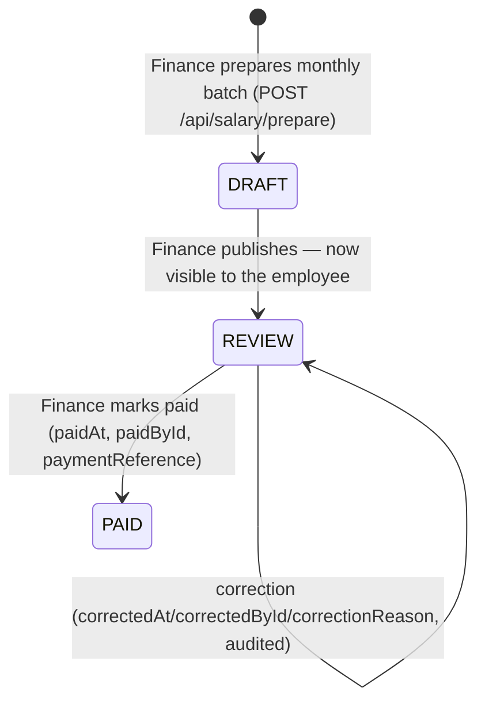

# 27 — Admin / Dashboard Architecture

> **What this section explains:** the internal CRM's structure — every module, how RBAC gates it, the standard CRUD pattern every module follows, and the self-service patterns used by newer modules like Salary and Leave.
>
> **Confidence:** Confirmed from direct research of `src/lib/rbac.ts`, `src/app/admin/**` (37 module folders, 66 `page.tsx` files), `src/app/admin/layout.tsx`, and `.ai/skills/admin-crud.md`.

---

## Quick Reference

| | |
|---|---|
| Modules | 32 (`MODULES` in `src/lib/rbac.ts`) |
| Admin folders | 37 |
| Admin pages | 66 `page.tsx` files |
| Standard pattern | List (`force-dynamic`) → new → `[id]/edit`, per `.ai/skills/admin-crud.md` |

## The full module registry

`src/lib/rbac.ts` → `MODULES`, in registration order:

| Key | Label | Route |
|---|---|---|
| dashboard | Dashboard | `/admin/dashboard` |
| packages | Packages | `/admin/packages` |
| destinations | Destinations | `/admin/destinations` |
| activities | Activities | `/admin/activities` |
| bookings | Bookings | `/admin/bookings` |
| leads | Leads | `/admin/leads` |
| itinerary | Itineraries | `/admin/itinerary` |
| proposals | Proposals | `/admin/proposals` |
| hotelSuppliers | Hotel Rates | `/admin/hotel-suppliers` |
| users | Customers | `/admin/users` |
| b2bAgents | B2B Agents | `/admin/b2b-agents` |
| b2bRequests | B2B Requests | `/admin/b2b-requests` |
| employees | Employees | `/admin/employees` |
| salary | Salary | `/admin/salary` |
| leave | Leave | `/admin/leave` |
| connect | Vertex Connect | `/admin/connect` |
| galleries | Galleries | `/admin/galleries` |
| blogs | Blogs | `/admin/blogs` |
| faqs | FAQs | `/admin/faqs` |
| home | Home Page | `/admin/home` |
| about | About Page | `/admin/about` |
| contact | Contact Page | `/admin/contact` |
| legal | Legal Pages | `/admin/legal` |
| campaigns | Adventures | `/admin/campaigns` |
| offlineConversions | Offline Conversions | `/admin/offline-conversions` |
| banners | Banners | `/admin/banners` |
| reviews | Reviews | `/admin/reviews` |
| seo | SEO & Pages | `/admin/seo` |
| settings | Settings | `/admin/settings` |
| roles | Roles & Permissions | `/admin/roles` |
| auditLog | Audit Log | `/admin/audit-log` |
| careers | Careers | `/admin/careers` |
| docs | Docs | `/admin/docs` |

This is a materially larger module set than `.ai/context/business-rules.md` lists (that document predates Proposals, Hotel Rates, B2B Agents/Requests, Employees, Salary, Leave, Audit Log, and Careers) — see §35 for this doc-drift finding.

Three admin folders exist (`b2b-bookings`, `blog-categories`, `faq-categories`) with **no corresponding `MODULES` entry** — these are sub-views nested inside another gated module (b2bAgents/blogs/faqs respectively), not independently permissioned. Two paths bypass module gating entirely: `mfa` and `profile` (`UNGATED_PATHS` in the admin layout — every staff member needs these reachable regardless of granted permissions).

## The standard CRUD shape

Per `.ai/skills/admin-crud.md`, most modules follow one consistent build (see §07 for the full mutation pattern):

```
src/app/admin/<module>/page.tsx                Server Component, force-dynamic, select-only-needed-columns, renders <Name>Client
src/app/admin/<module>/new/page.tsx            No DB access, no force-dynamic needed
src/app/admin/<module>/[id]/edit/page.tsx      Fetches record, notFound() if missing, renders form with defaults

src/components/admin/<module>/<Name>Client.tsx  "use client" — list/table, useTransition+fetch+toast+router.refresh()
src/components/admin/<module>/<Name>Form.tsx    React Hook Form + zodResolver, dual-use create/edit via a `defaults` prop
```

Sub-route shapes actually observed across the 37 folders vary by module need:

| Shape | Modules |
|---|---|
| Full CRUD (list + new + [id]/edit) | activities, blogs, banners, careers, destinations, faqs, packages |
| List + new + [id] (no separate /edit) | campaigns, proposals, itinerary, hotel-suppliers (no [id]), offline-conversions (no new) |
| List + new + [id] + [id]/edit | leads |
| List + [id] only (no create) | b2b-requests, b2b-itineraries, bookings ([id]/services sub-route) |
| List only, no sub-pages | settings, home, about, contact, legal, seo, connect, galleries, reviews, employees, dashboard, users, salary, roles, audit-log, docs, b2b-agents, b2b-bookings, blog-categories, faq-categories, leave |
| Special ungated utility | mfa, profile |

## Every mutating verb is individually guarded

`.ai/skills/admin-crud.md`'s central rule: all four verbs (GET/POST/PATCH/DELETE) call `requirePermission` **individually** — a passing check on one verb never implies another is guarded. The most common real mistake this pattern exists to prevent: forgetting the `MODULES` registration (module silently has no sidebar entry and no working permission key) or forgetting the `RolePermission` seed rows (works for SUPERADMIN, locked out for everyone else).

## Newer self-service pattern: Salary and Leave

Unlike the pure staff-vs-staff CRUD modules above, Salary and Leave are **self-service by default**, with an elevated view layered on top — confirmed directly in `src/app/api/salary/route.ts` and `src/app/api/leave/route.ts`:

- **Salary `GET`**: any staff member holding `salary:view` sees their **own** payroll history, scoped `where: { employeeId: userId, status: { in: ["REVIEW", "PAID"] } }` — `DRAFT` records are hidden from self-service (Finance hasn't finalized them yet). Only a `salary:edit` holder ("Finance") gets the org-wide month table across all staff.
- **Leave `GET`**: self-service by default — own `LeaveRequest` history plus a computed leave balance (`computeLeaveBalance()`, §28/§02 — no stored balance field; entitlement is 1.5 paid days/month with no carry-forward, computed on read from approved requests). `?scope=pending` additionally returns the org-wide approval queue, but **only if `can(role, "leave", "edit")` is true** — the route never trusts a client-sent scope flag alone to decide what it returns.
- **Leave `POST`** (apply): always allowed for any authenticated staff member with base `leave:view`, regardless of any elevated permission.

This is a deliberate variation on the CRUD pattern above — worth knowing before assuming every admin route follows the "staff sees only what their role's `RolePermission` row explicitly grants, org-wide" shape.

## Salary lifecycle (DRAFT → REVIEW → PAID)



One `SalaryRecord` row per employee per calendar month (`salaryMonth: "YYYY-MM"`), values snapshotted at prepare time (`monthlySalary`, `paidDays`/`absentDays`/`paidLeaveDays`/`unpaidLeaveDays`, `deductions`, computed `netSalary`). Commission flows in via `BookingCommission.salaryRecordId` claims (§26), plus a manual `commissionAdjustment` field Finance can use without touching `BookingCommission` rows directly. Corrections are separately audited (`AuditAction.SALARY_CORRECTED`).

## The Dashboard — full widget inventory, and the SALES self-scoping pattern

`/admin/dashboard` (`src/app/admin/dashboard/page.tsx`) is entirely server-rendered and, crucially, **role-scoped by query, not by a separate view** — the same page and the same component tree render for every role, but every underlying query is filtered based on who's looking:

```ts
const isAdmin = role === "SUPERADMIN" || role === "ADMIN";
const bookingScope = { deletedAt: null, ...bookingWhereForUser(role, userId) };
const leadScope = { b2bAgentId: null, ...(isAdmin ? {} : { assignedToId: userId }) };
```

For a SALES user, this means the entire Dashboard — every number described below — is silently their **own personal dashboard**: only their assigned leads, only bookings converted from them. There is no admin-side view that compares or ranks staff against each other (§13, §14, §35) — this is the same "scope the query, reuse the page" pattern Salary/Leave use for self-service, applied to reporting instead of payroll.

The full widget set, top to bottom:

| Widget | What it shows |
|---|---|
| 5 KPI cards | Total Revenue, Total Bookings, Total Leads, Conversion Rate, Avg Booking |
| Revenue chart | `RevenueChartLazy` (Recharts, lazy-loaded) — last 6 calendar months, bucketed server-side in Postgres |
| Recent Bookings | 8 most recent, with tour image, amount, lifecycle status badge, derived payment-status badge |
| Recent Leads | 8 most recent — name, phone, source, travel date, status |
| Top Performing Tours | Top 5 by all-time net revenue, ranked in SQL — booking count + rating per tour |
| Reviews Awaiting Approval | Up to 5 unapproved reviews |
| Quick Actions | New Package, Add Destination, Add Blog Post, View Bookings, Export Report, Site Settings |

Two details worth knowing precisely: **Revenue is computed from the actual `BookingPayment` ledger** (net of REFUND rows, via the same `computeBookingFinance`-adjacent logic as everywhere else in the app, §26), **never from `Booking.status`** — because a manually-recorded offline/cash payment doesn't necessarily flip `status` to `PAID`, so reading `status` alone would undercount real revenue. And **"Conversion Rate" is `paidCount / totalLeads`, a single scoped aggregate** — not a per-salesperson breakdown, and not comparable across staff from this page. The **"Export Report" Quick Action is a dead link** (`href="#"`) — flagged in §35, not a feature to assume works.

## The Docs module — a live, in-progress example

The `docs` module (`/admin/docs`) is currently under active development in this repository (visible directly in `git status` at the time of this documentation pass) and is a clean, minimal instance of the standard pattern: `AdminDocument` (uploaded files) and `AdminDocLink` (external URL + free-text purpose, stamped with `createdById`/`createdByName` for an audit trail) share one RBAC module key, gated per-action (`create`/`edit`/`delete` control button visibility in `DocLinksSection.tsx`, enforced server-side in the matching API routes via `requirePermission("docs", <action>)`), validated by shared Zod schemas in `src/lib/docs/linkSchema.ts`. This documentation set itself is a candidate for being linked from that same admin page.

## Related Documents

- `.ai/skills/admin-crud.md`, `.ai/skills/crm-ticket.md` — the build patterns this section documents
- §10 Authentication & Authorization — the three-layer enforcement these modules sit behind
- §09 API Architecture — the full route inventory backing each module
- §13 Analytics & Tracking, §14 CRM & Lead Management — the absence of sales-performance/leaderboard analytics, in full business context
- §26 Core Business Flows — the Salary/Commission/Leave lifecycles in the context of the whole business flow
- §35 Technical Debt — the `.ai/context/business-rules.md` module-list drift, the dead "Export Report" link, and the follow-up-worklist gap
