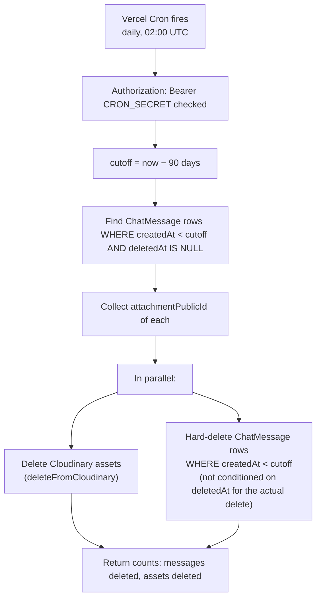
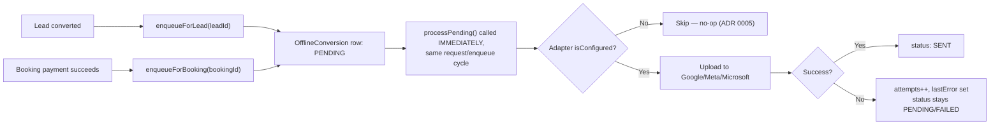

# 28 — Background Jobs / Cron / Webhooks

> **What this section explains:** every scheduled and asynchronous process in VK — what actually runs on a schedule versus what only exists as a route with no scheduler wired to it, and why.
>
> **Confidence:** Confirmed from `vercel.json` (full contents), direct inspection of all three `src/app/api/cron/**` route files (including their own explanatory code comments), and the Vertex Connect/webhook research passes.

---

## Quick Reference

| Job | Scheduled? | Trigger |
|---|---|---|
| `connect-retention` | **Yes** — Vercel Cron, daily `0 2 * * *` (02:00 UTC) | Vercel scheduler + `CRON_SECRET` bearer check |
| `offline-conversions` | **No** | Real trigger: immediate processing at enqueue time (`enqueueForLead`/`enqueueForBooking`). This route is a manual/backup sweep only. |
| `stale-bookings` | **No** | Real trigger: inline call from `create-order` on live traffic. This route is a manual/backup sweep only. |
| Razorpay webhook | N/A (inbound, not scheduled) | Razorpay calls it server-to-server on payment events |

**Why two of three cron routes aren't scheduled**: both carry explicit in-code comments stating the reason is a **Vercel Hobby-plan cron-frequency limitation** — the sweep needs to run more often than Hobby allows, so their `vercel.json` entries were removed and the real-time/inline trigger path was built instead. Both comments explicitly say to re-add the `vercel.json` cron entry "when on Pro — no code change needed here." This is a **known, deliberate, and already-compensated-for** limitation, not a bug.

## `vercel.json` — the complete, actual file

```json
{
  "crons": [
    {
      "path": "/api/cron/connect-retention",
      "schedule": "0 2 * * *"
    }
  ]
}
```

Exactly one entry. This is the single source of truth for what Vercel itself schedules.

## Job 1 — Vertex Connect retention (`GET /api/cron/connect-retention`)



**Purpose**: bounds the storage/database growth of internal staff chat history and removes stale Cloudinary attachments past a fixed retention window. `RETENTION_DAYS = 90` is confirmed directly in code, matching the figure documented elsewhere in this organization's institutional knowledge. This is the **only** automated data-deletion policy confirmed anywhere in the system — no other model has a scheduled purge (§31 Disaster Recovery discusses this gap for other data types).

## Job 2 — Offline conversions sweep (`GET /api/cron/offline-conversions`)

Not scheduled (see above). The **real** production path:



The cron **route** still exists and works if hit manually (with the `CRON_SECRET` bearer token) or via the admin-facing manual-sweep endpoints (`POST /api/offline-conversions/process-pending`, `/retry`, `/[id]/retry` — §09) — these are the actual, currently-relied-upon backup mechanism for anything that failed on its first immediate attempt, since the Vercel-scheduled sweep that would normally catch stragglers doesn't run.

## Job 3 — Stale bookings sweep (`GET /api/cron/stale-bookings`)

Not scheduled (see above). The real production path: `cleanupStalePendingBookings()` (`src/lib/bookings/cleanup.ts`, `STALE_BOOKING_MINUTES` constant) is called **inline** from `POST /api/bookings/create-order` on every real request — piggybacking cleanup onto normal traffic rather than a dedicated scheduled sweep. A `PENDING` booking with a Razorpay order created but never completed (abandoned checkout) is what this cleans up.

## Webhooks — inbound, not scheduled

| Path | Mechanism | Purpose |
|---|---|---|
| `POST /api/bookings/webhook` | HMAC-SHA256 over the raw request body, `x-razorpay-signature` header, `crypto.timingSafeEqual` compare | The reconciliation safety net for online payments — see §26 Flow 2 |

Full mechanism detail in §09/§21. This is genuinely inbound and event-driven (Razorpay calls VK), unlike the cron routes above which are polling-style even when scheduled.

## What does NOT exist

- **No message queue** (BullMQ, SQS, etc.) — confirmed absent (§04). Every "background" process here is either a Vercel Cron GET request or an inline call piggybacked on real user traffic — there is no durable job queue with retry/backoff semantics beyond `OfflineConversion.attempts`.
- **No worker process** — VK has no long-running background worker; everything is a serverless function invocation, consistent with the "no container orchestration" characteristic noted in §18.
- **No event-driven architecture** — explicitly named in `.ai/context/business-rules.md` §11 as scoped for "assess and document a decision," not built.

## Related Documents

- `vercel.json` — the literal source of truth for what's actually scheduled
- §09 API Architecture — the full route signatures for every job above
- §18 Infrastructure & Hosting — the Vercel Hobby-plan constraint driving the unscheduled-cron design
- §13 Analytics & Tracking — the offline-conversion business context
- §26 Core Business Flows — the stale-booking cleanup and webhook reconciliation in full payment-flow context
- §31 Disaster Recovery — the retention/deletion-policy gap for data types other than Connect chat
