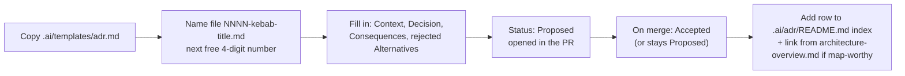

# 34 — Architecture Decision Records (ADRs)

> **What this section explains:** what an ADR is in this repository, the lightweight process for writing one, and the full current index — reproduced here for a single-page reference, with the source of truth remaining `.ai/adr/`.
>
> **Confidence:** Confirmed from `.ai/adr/README.md` and all six accepted ADR files, read in full.

---

## What an ADR is here

A short, dated record of one significant architectural decision — the context that forced the choice, the decision itself, and the accepted consequences. It captures the *why* that would otherwise live only in a commit message, a comment, or one person's memory.

ADRs are **append-only history**. An accepted ADR is never edited to reflect a later change of mind — a new ADR supersedes it. This is the difference between an ADR and `.ai/instructions/architecture.md`: the ADR records what was decided *at a point in time*; the instructions doc records what the rule *is now*. If they ever disagree, the ADR is authoritative on *why*, the instructions doc is authoritative on *the current rule*.

## When the team writes one

When a decision is **hard to reverse or expensive to get wrong**, and a future engineer would reasonably ask "why is it done this way?" — choosing/rejecting a framework or service, adopting/forbidding a cross-cutting pattern, a security or data-integrity decision, or anything defended more than once in review. Not for reversible/local choices (a variable name, a component split) or a business rule (those belong in `.ai/context/business-rules.md`, see §02).

## Process

Status lifecycle: `Proposed → Accepted → Deprecated` or `→ Superseded by NNNN`. A superseded ADR is never deleted — the history is the point.

## Current index (6 accepted ADRs)

| # | Title | Status | One-line decision |
|---|---|---|---|
| [0001](../../.ai/adr/0001-route-handlers-over-server-actions.md) | Route Handlers over Server Actions | Accepted | One mutation style app-wide — `fetch()` + `useTransition()` against `src/app/api/**`; `"use server"` used nowhere |
| [0002](../../.ai/adr/0002-prisma-neon-postgres.md) | Prisma + PostgreSQL (Neon), separate dev/prod databases | Accepted | One typed data-access path; forward-only migrations; dev experiments never reach prod data |
| [0003](../../.ai/adr/0003-nextauth-three-layer-authorization.md) | NextAuth v5 with three-layer authorization | Accepted | Middleware → admin layout → `requirePermission` — no single layer is the sole guard |
| [0004](../../.ai/adr/0004-server-computed-pricing.md) | Server-computed pricing | Accepted | The client sends *what* to buy, never *how much* — every amount is recomputed server-side |
| [0005](../../.ai/adr/0005-integration-adapter-pattern.md) | Adapter pattern for external integrations | Accepted | Common interface + `isConfigured()` guard per provider; swapping a vendor touches one file |
| [0006](../../.ai/adr/0006-domain-logic-in-lib.md) | Business logic in `lib/<domain>`, finance single-sourced | Accepted | `computeBookingFinance`/`resolveGst` are the only place money is computed |

Full narrative, rejected alternatives, and consequences for each are in §03 (Architecture) and the linked ADR files themselves — this section is the index and process reference; §03 is where each decision is explained in the context of the system it shapes.

## No ADRs exist yet for several load-bearing choices

Notably, there is **no standalone ADR** for: the choice of Vercel as the hosting platform, Cloudinary over an alternative media store, Razorpay over another payment gateway, or the decision to keep three surfaces (public/account/admin) in one Next.js app rather than separate services. These are real, consequential decisions — per `.ai/adr/README.md`'s own guidance ("anything you find yourself defending more than once in review"), several of these plausibly qualify. Their reasoning is partially reconstructable from `.ai/context/tech-stack.md` and `.ai/context/architecture-overview.md`, but is not captured as a formal, append-only decision record. **Documentation gap, not a decision to invent here** — see §35.

## Related Documents

- `.ai/adr/README.md` — the authoritative process document and live index
- `.ai/context/architecture-overview.md` — the curated map linking decisions to their ADRs
- §03 Architecture — the full narrative behind each decision
- §35 Technical Debt — the missing-ADR gap noted above
